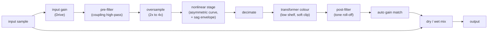

# Analog emulation: tube and transistor "euphonics"

Research summary and an itemized plan for adding tube and transistor
character to the PCM playback chain. Branch: `analog-poc`. Status: **Phases 0 to 3 done** (research, a working stage in the engine,
the triode curve derived from Koren's model, and antiderivative
antialiasing), sag and transformer colour (section 14), plus **an A/B test panel in
Settings** (section 13). Findings: section 10; Phase 1 results: 11;
Phase 2 results: 12.

Written for the Kahawai maintainers. Related: [Backlog.md](Backlog.md)
(DSP effects section), [EQ.md](EQ.md) (pipeline and the `DspStage` idea).

How to read the claims below:

- **[cited]** comes from a source in section 9, found in this research pass.
  I read the search summaries, not the full papers, so treat details as
  leads to confirm in Phase 0.
- **[known]** is general audio-DSP background I am confident of but did not
  source here.
- **[guess]** is my estimate and must be measured before it is relied on.

---

## 1. Goal and non-goals

**Goal:** an optional, subtle "warmth" stage in the shared PCM path that
can be switched among a few flavours (tube and transistor), with a drive
control and a dry/wet mix, sounding good on music at normal listening
levels and costing little CPU.

**Non-goals:**
- Not circuit-accurate emulation of a specific product. We model
  *character* (harmonics, level-dependent softness, a little dynamics), and
  name presets as flavours, not brands.
- Not a guitar-amp simulator (no tone stacks, cabinets, heavy clipping).
- Not on the exclusive paths: DoP and bit-perfect playback bypass it, as
  they do EQ, loudness and volume.

---

## 2. What makes tubes and transistors sound different (the target)

All **[known]** unless marked:

| Trait | Typical tube behaviour | Typical transistor / op-amp behaviour |
|---|---|---|
| Harmonic balance | A single-ended triode stage is asymmetric: mostly **2nd harmonic** (even), then 3rd, falling off smoothly | Symmetric clipping: mostly **3rd and other odd** harmonics; can be very clean below clipping |
| Onset | Distortion rises gradually with level ("soft knee") | Very low distortion until the rail, then an abrupt knee (hard clipping) |
| Dynamics | Power-supply sag and recovery compress loud passages slightly | Stiff supplies: little sag |
| Low end | Output transformer saturates at low frequencies and loud levels, rolls off the extremes | Direct coupled, or transformer in classic console preamps |
| Grid current | Positive grid drive draws current and clips hard on that side (**[cited]**: the Koren model includes a grid-cathode diode) | n/a |

At music levels the audible effect is a **low-order harmonic colouring that
grows with level**, plus mild compression. Getting that right, without
aliasing, matters more than circuit detail.

---

## 3. Research findings

### 3.1 Modelling approaches, from cheap to expensive

| Approach | What it is | Fit for us |
|---|---|---|
| **Static waveshaper** with asymmetry and filters around it | A memoryless curve (tanh, polynomial, or a table) placed between pre- and post-filters. The classic "tubes as filters + waveshapers" approach (**[cited]**: described as a common approach in the DAFx literature) | **Best first step.** Cheap, controllable, easy to test |
| **Fitted tube curve** (Koren) | Norman Koren's phenomenological triode equations fit datasheet curves well (**[cited]**). Koren's own 12AX7 set: mu 100, Ex 1.4, Kg1 1060, Kp 600, Kvb 300 (**[cited]**, read from his page in Phase 0; a different fit with mu 100.26, Ex 1.394, Kg1 1651.8, Kp 1000, Kvb 524 also circulates, so the set to use is a Phase 0 decision). Most physically informed tube simulations still use Koren's or Cardarilli's model (**[cited]**) | **Phase 2.** Use it to *derive* the static curve and its asymmetry, and to build a lookup table; do not solve the circuit per sample at first |
| **Wave digital filters (WDF)** | Simulates the whole stage (tube plus resistors and capacitors) with one nonlinear element solved without iteration. Well studied for triode stages (**[cited]**: Pakarinen and Karjalainen's enhanced WDF triode; the RT-WDF library) | A possible later upgrade (Phase 5). More faithful, more code and CPU |
| **State-space / SPICE-style solvers** | Newton iteration per sample | Too heavy and fragile for a background playback thread |
| **Neural black-box models** | Learn a device from recordings (**[cited]**: a 2018 paper on tube amplifier emulation) | Needs data and training tooling; hard to keep light and deterministic. Not for a first version |

### 3.2 Aliasing is the main quality risk

A nonlinearity creates harmonics above the original band. Without
protection they fold back below Nyquist as inharmonic, harsh distortion.
Two families of fixes:

- **Oversampling** (2x to 8x around the nonlinear part, with good
  anti-alias and decimation filters). Robust and simple to reason about.
  Costs CPU in proportion to the factor, and adds latency with linear-phase
  filters (**[known]**).
- **Antiderivative antialiasing (ADAA)**, introduced by Parker, Zavalishin
  and Le Bivic (DAFx 2016) and developed by Bilbao, Esqueda, Parker and
  Välimäki (**[cited]**). It reduces aliasing without oversampling, for
  memoryless nonlinearities. It needs the antiderivative of the curve
  (closed form for tanh and hard clip). There are extensions to stateful
  systems (**[cited]**). Often combined with a small oversampling factor.

Our sources are 44.1 to 192 kHz. Content at 96 kHz and above has a lot of
headroom already, so the required oversampling depends on the source rate:
**[guess]** 4x at 44.1/48 kHz, 2x at 88.2/96 kHz, none or ADAA-only above.
Confirm by measuring aliasing (section 6).

### 3.3 Output transformer and power-supply sag

- Transformer saturation and hysteresis are usually modelled with the
  Jiles-Atherton theory (**[cited]**), which is accurate but implicit and
  hard to fit and run in real time (**[cited]**). Cheaper alternatives are a
  level-dependent low-shelf plus a soft clip, or a small hysteresis-like
  state (**[known]**). Start with the cheap version.
- Sag can be modelled as a slow (tens of milliseconds) envelope of the
  signal that lowers the stage's supply, which lowers headroom and gain
  (**[known]**). It is a control-rate effect and cheap.

### 3.4 Existing implementations (license matters)

- **libmksim** (Rust; WDF plus Newton solvers for tubes, diodes, transistors,
  op-amps; MIT). **Phase 0 verdict: reference at most, not a dependency.**
  The GitHub repository was created on 2026-03-08 and its four commits all
  landed within 11 minutes, it has 3 stars, is not on crates.io, and its
  README calls AVX-512 a placeholder. No track record.
- **RT-WDF** (C++ WDF library). **Verdict: skip.** No license file (GitHub
  shows none), last pushed in 2017, needs the Armadillo C++ library, and
  the material I could read does not show a triode example.
- **Antialiasing reference code:** Chowdhury's ADAA repository is
  BSD-3-Clause (usable as a reference); Parker's DAFX-AntiAliasing repository
  has no license (read, do not copy).
- Some well-known open-source emulations are GPL (**[known]**, not checked
  for any specific project). Rule from the Backlog: do not copy code from
  a project until its license is confirmed compatible.

---

## 4. Proposed design

### 4.1 Where it lives

- A new module `analog.rs` in
  [kahawai-player-core](crates/kahawai-player-core/src/) (pure Rust, no
  platform imports, like `dsp.rs`).
- A small trait so stages compose (this is the `DspStage` idea from
  EQ.md):

```rust
pub trait DspStage: Send {
    fn prepare(&mut self, sample_rate: u32, channels: u16);
    fn process(&mut self, interleaved: &mut [f32]);   // in place
    fn latency_frames(&self) -> u32 { 0 }
    fn reset(&mut self);
}
```

- Chain order in `pump_pcm` (see [engine.rs](crates/kahawai-player-core/src/engine.rs)):
  decode, resample, **EQ, analog stage**, loudness gain, volume, sink. The
  analog stage goes after the EQ so the user's EQ shapes what is driven,
  and before loudness and volume so drive is independent of listening level.
  (Open question Q3.)



### 4.2 Controls

| Control | Meaning | Range |
|---|---|---|
| **Flavour** | Selects a preset set of the parameters below | see 4.3 |
| **Drive** | Input level into the nonlinearity | 0 to 100 percent |
| **Mix** | Parallel blend of the dry signal | 0 to 100 percent, default about 30 to 50 |
| **Output** | Level trim (auto gain-matched by default) | plus or minus a few dB |
| (advanced, later) Bias / asymmetry, Sag, Tone | Expose only if useful | |

Defaults must be conservative: a subtle change, never louder than dry.

### 4.3 Flavour presets (names describe character, not brands)

| Flavour | Character | Main ingredients |
|---|---|---|
| **Warm triode** | Soft, even-harmonic warmth | Asymmetric curve derived from a high-mu triode, gentle sag, light transformer colour |
| **Push-pull tube** | Fuller, slightly compressed | Symmetrical stage (odd bias with some even), more sag, more transformer colour |
| **Solid-state console** | Clean, punchy, a little edge at high drive | Symmetric soft curve with a slightly sharper knee, no sag, light transformer colour |
| **Hard transistor** | Aggressive, for effect | Symmetric hard-ish clip with ADAA |

Inspired-by references (for our own measurement targets only, not for the
UI): single-ended triode line stages, push-pull power stages, classic
transformer-coupled console preamps. Final list to be chosen in Phase 0.

---

## 5. Itemized plan

Sizes: **S** an hour or two, **M** a day, **L** several days. Each phase ends
with something we can listen to and a green test suite.

### Phase 0: research and decisions (M) *(this document is the start)*

| # | Item | Output |
|---|---|---|
| 0.1 | Read the key sources in section 9 in full (Koren tube models, ADAA, WDF triode, transformer emulation) | **Partly done.** Koren's equations and parameters read and used; ADAA basics implemented and measured. WDF and transformer papers not yet read in full |
| 0.2 | Choose reference behaviours: target harmonic profiles (2nd/3rd/5th versus drive level) for each flavour | **Provisional.** Profiles measured from the prototype (section 10.2); still to be checked against published measurements |
| 0.3 | Check libmksim and RT-WDF: maturity, maintenance, license, API fit | **Done.** Neither is a dependency (section 3.4) |
| 0.4 | Measure the CPU budget | **Done** for a prototype (section 10.4) |
| 0.5 | Decide the open questions in section 7 | **Waiting on you.** Recommendations are in section 10.5 |

### Phase 1: the seam and a working static stage (M to L) *(done, see section 11)*

| # | Item | Status |
|---|---|---|
| 1.1 | Extract the `DspStage` trait; make `ParametricEq` implement it | Done |
| 1.2 | `AnalogStage`: input gain, asymmetric waveshaper, dry/wet mix, auto gain match | Done (two flavours) |
| 1.3 | Oversampling wrapper, 2x and 4x, built once and reused | Done (Kaiser FIR, streaming) |
| 1.4 | Fade-in/out on parameter change and on/off | Done, including flavour changes |
| 1.5 | Wire into `pump_pcm` after the EQ; PCM shared path only; DoP and bit-perfect bypass | Done |
| 1.6 | Engine command, settings persistence | Done (no UI, no snapshot field) |

### Phase 2: derive curves from tube models (M) *(done, see section 12)*

| # | Item | Status |
|---|---|---|
| 2.1 | Evaluate the Koren triode equations and produce a normalized transfer curve for a chosen tube and load line | Done, at runtime rather than as a stored table (built in about 20 ms on first use; tested against the model) |
| 2.2 | Replace the hand-made curve with a table lookup for the tube flavour | Done; harmonic profile matches the prototype targets (test) |
| 2.3 | Add ADAA for the table curve so the oversampling factor can drop | Done; measured. ADAA is nearly free and clearly helps, but the factor was kept because oversampling is cheap enough (section 12.3) |

### Phase 3: dynamics and transformer colour (M) *(done, see section 14)*

| # | Item | Status |
|---|---|---|
| 3.1 | Sag: slow envelope follower that lowers headroom and gain, with attack and recovery | Done |
| 3.2 | Transformer colour: cheap level-dependent low shelf plus soft clip; evaluate a hysteresis state as a follow-up | Done (bass soft clip); hysteresis not tried |
| 3.3 | Tone shaping: coupling and roll-off filters per flavour | Partly: the 10 Hz coupling high-pass exists; a per-flavour roll-off was judged not worth adding (section 14.3) |

### Phase 4: UI (M)

| # | Item | Notes / acceptance |
|---|---|---|
| 4.1 | "Warmth" button next to the EQ button, opening a modal in the EQ dialog's style | Same look, both themes |
| 4.2 | Flavour picker, Drive, Mix, Output; live preview with OK / Cancel, like the EQ | Cancel reverts |
| 4.3 | Dim with "not supported for this stream type" on exclusive paths | Same rule as the EQ |
| 4.4 | Guardrails: limit drive, warn when the stage will clip the output; gain-matched A/B toggle | Consistent with the EQ guardrails |
| 4.5 | Tests: component, store, and a house-style check | Green |

### Phase 5: optional higher fidelity (L, only if Phases 1-4 are not enough)

| # | Item | Notes |
|---|---|---|
| 5.1 | WDF-based triode stage (or libmksim) for one flavour | Compare against the table version by ear and measurement |
| 5.2 | Jiles-Atherton transformer for one flavour | Only if the cheap version is clearly lacking |
| 5.3 | Move the EQ, analog and future stages into a small chain editor | Backlog: "Effects chain UI" |

---

## 6. Verification plan

Everything is deterministic DSP, so most of it is testable in Rust without
listening. Listening tests still decide "does it sound good".

1. **Harmonic profile.** Feed a 1 kHz sine at several levels, take an FFT,
   and check the 2nd, 3rd and 5th harmonic levels versus drive against the
   flavour's targets (tolerance in dB).
2. **Aliasing.** Feed a high-frequency sine (for example 15 to 20 kHz at
   44.1 kHz) hard, and check that no inharmonic component rises above a
   threshold below the fundamental. Run at 44.1, 96 and 192 kHz. Compare
   oversampling factors and ADAA.
3. **Transparency.** With the stage off, or mix 0, the output equals the
   input bit for bit. At low drive and low levels, distortion stays below a
   stated figure.
4. **No clicks.** Change parameters and toggle the stage while a tone
   plays; measure the largest sample-to-sample jump, as in the EQ tests.
5. **Level and gain match.** Loudness of the wet and dry signal within
   about 1 dB at default settings.
6. **Path rules.** DoP and bit-perfect output are bit-identical with the
   stage enabled (as the existing DoP test does for the EQ).
7. **Performance.** Cost per chunk at 44.1 and 192 kHz stereo stays under a
   set share of the chunk's real-time duration (budget from item 0.4).
8. **Listening.** A/B on a fixed set of tracks (acoustic, vocal, dense rock,
   electronic) with gain matching, before merging each phase.

---

## 7. Open questions (decide in Phase 0)

- **Q1. Which stages to offer first?** All four flavours in 4.3, or one
  tube and one transistor flavour?
- **Q2. Oversampling or ADAA first?** Oversampling is simpler and more
  robust; ADAA saves CPU. Plan: oversampling in Phase 1, ADAA in Phase 2.
- **Q3. Where in the chain?** After the EQ and before loudness and volume
  (proposed), or after loudness? It changes how drive relates to level.
- **Q4. Latency.** Linear-phase oversampling filters add a fixed delay
  (a few milliseconds). Accept it and compensate in the playhead, or use
  minimum-phase filters?
- **Q5. Gain match.** Automatic (safer for A/B) or manual?
- **Q6. libmksim.** Dependency, reference, or ignore?
- **Q7. Naming and legal.** Preset names describe character; confirm we are
  comfortable with "inspired by" notes in documentation only.

---

## 8. Risks

| Risk | Mitigation |
|---|---|
| CPU cost at 192 kHz stereo on the playback thread | Measure first (0.4); reduce oversampling at high rates; ADAA |
| Aliasing sounds harsh | Aliasing tests (6.2) gate every phase |
| "Warmth" is subjective and easy to overdo | Conservative defaults, gain-matched A/B, clip warning |
| Clipping past 0 dBFS (no limiter in the chain today) | Auto gain match, drive limits, and the headroom item in the Backlog |
| Licence contamination from borrowed code | Own implementations from papers; license check before reuse |
| Model accuracy claims | We claim character, not fidelity to a named product |

---

## 9. Sources

Found in this research pass (search summaries read; confirm in full in
Phase 0.1):

- Koren, "Improved vacuum tube models for SPICE simulations":
  [part 1](https://www.normankoren.com/Audio/Tubemodspice_article.html),
  [part 2](https://www.normankoren.com/Audio/Tubemodspice_article_2.html)
- [Nonlinear SPICE models of vacuum-tube triodes (Electronic Design)](https://www.electronicdesign.com/technologies/analog/article/55246421/modeling-on-mondays-nonlinear-spice-models-of-vacuum-tube-triodes-part-3)
- [Measures and models of real triodes, for the simulation of guitar amplifiers](https://www.researchgate.net/publication/281075913_Measures_and_models_of_real_triodes_for_the_simulation_of_guitar_amplifiers)
- [A quadric surface model of vacuum tubes for virtual analog (DAFx 2023)](https://dafx.de/paper-archive/2023/DAFx23_paper_15.pdf)
- [New family of wave-digital triode models (Aalto)](https://aaltodoc.aalto.fi/bitstreams/c94fca6e-463e-4f8e-a25d-9dce4aa4e8c8/download)
- [Enhanced wave digital triode model for real-time tube amplifier emulation (IEEE)](https://ieeexplore.ieee.org/document/5272282/)
- [A Csound opcode for a triode stage of a vacuum tube amplifier (DAFx 2011)](http://recherche.ircam.fr/pub/dafx11/Papers/42_e.pdf)
- [RT-WDF: modular wave digital filter library (DAFx)](https://www.dafx.de/paper-archive/details/ilZF4akpmSxzyiusoAOolg)
- [libmksim (Rust, MIT): real-time circuit simulation for audio DSP](https://github.com/mkaudio-company/libmksim)
- Antialiasing: Parker, Zavalishin, Le Bivic, "Reducing the aliasing of
  nonlinear waveshaping using continuous-time convolution" (DAFx-16);
  Bilbao, Esqueda, Parker, Välimäki, "Antiderivative antialiasing for
  memoryless nonlinearities" (IEEE SPL 2017); see also
  [the companion code](https://github.com/julian-parker/DAFX-AntiAliasing),
  [antiderivative antialiasing for stateful systems](https://www.hsu-hh.de/ant/wp-content/uploads/sites/699/2020/10/DAFx2019_paper_4.pdf),
  and [practical considerations for ADAA](https://jatinchowdhury18.medium.com/practical-considerations-for-antiderivative-anti-aliasing-d5847167f510)
- Transformers: [a transformer model based on the Jiles-Atherton theory](https://www.researchgate.net/publication/270465159_A_transformer_model_based_on_the_Jiles-Atherton_theory_of_ferromagnetic_hysteresis),
  [real-time audio transformer emulation for virtual tube amplifiers](https://www.researchgate.net/publication/220057543_Real-Time_Audio_Transformer_Emulation_for_Virtual_Tube_Amplifiers)
- [Deep learning for tube amplifier emulation](https://arxiv.org/pdf/1811.00334)

---

## 10. Phase 0 findings

A throw-away prototype lives in [research/analog-spike/](research/analog-spike/)
(a standalone Rust program, not part of the player; run it with
`cargo run --release`, output saved in
[RESULTS.txt](research/analog-spike/RESULTS.txt)). It is unoptimized research
code, so treat the numbers as ballpark, measured on an Intel Core i9-9900K.

### 10.1 What the prototype has

- Four memoryless shapers: an asymmetric tanh (a bias term adds even
  harmonics), a symmetric tanh, a hard clip, and a **12AX7 triode stage
  computed from Koren's equations** (300 V supply, 100 kΩ load, about −1.5 V
  bias) turned into a lookup table.
- Anti-aliasing options: none, first-order ADAA (analytic antiderivative),
  and 2x, 4x and 8x oversampling (Kaiser-windowed FIR, 32 taps per phase).
- The existing 8-band EQ from the player, for a CPU baseline.

### 10.2 Harmonic profiles (dB relative to the fundamental)

| Shaper | Input level | 2nd | 3rd | 4th | 5th | THD |
|---|---|---|---|---|---|---|
| 12AX7 stage (Koren) | 0.1 | −42 | −79 | −128 | −153 | 0.8% |
| | 0.3 | −33 | −60 | −99 | −115 | 2.4% |
| | 0.6 | −26 | −48 | −82 | −91 | 4.8% |
| | 1.0 | −22 | −38 | −71 | −76 | 8.4% |
| Asymmetric tanh (bias 0.4, gain 1.5) | 0.1 | −31 | −60 | −82 | −130 | 2.8% |
| | 0.3 | −22 | −40 | −54 | −88 | 8.0% |
| | 1.0 | −17 | −20 | −29 | −41 | 18% |
| Symmetric tanh (gain 2) | 0.1 | none | −50 | none | −98 | 0.3% |
| | 0.3 | none | −31 | none | −61 | 2.8% |
| | 1.0 | none | −16 | none | −28 | 17% |
| Hard clip (gain 2) | 0.1 to 0.3 | none | none | none | none | 0% |
| | 0.6 | none | −24 | none | −30 | 7.3% |
| | 1.0 | none | −13 | none | −27 | 23% |

What this shows:

- The **triode stage behaves like the textbook**: the 2nd harmonic dominates
  (about 20 dB above the 3rd), and it rises 1 dB per dB of input, while the
  3rd rises 2 dB per dB. That is the "warm" signature and it falls out of
  Koren's equations with no tuning.
- A **symmetric curve gives only odd harmonics** (no 2nd or 4th), as
  expected for push-pull and transistor stages.
- A **hard clip is perfectly clean until it clips**, then produces strong odd
  harmonics. That is the "hard transistor" flavour, and it is why a soft
  knee is much more pleasant at moderate levels.
- The asymmetric tanh is a workable, cheaper stand-in for the triode, but
  its harmonics rise faster than the real curve's. Its 4th harmonic is much
  higher than the triode's.

These are **provisional targets** (item 0.2): they come from my model, not
from published measurements of real tubes.

### 10.3 Aliasing (the risk that decides the design)

Level of everything in the audible band that is *not* a harmonic of the
tone (that is aliasing), relative to the tone. Heavy test: asymmetric tanh
at gain 3 and input 0.8, deliberately harsh.

| Sample rate, tone | No protection | ADAA (1st order) | 2x oversampling | 4x | 8x |
|---|---|---|---|---|---|
| 44.1 kHz, 6 kHz | −26 dB | −38 dB | −63 dB | −106 dB | −105 dB |
| 44.1 kHz, 9.5 kHz | −14 dB | −26 dB | −42 dB | −91 dB | −104 dB |
| 96 kHz, 9.5 kHz | −51 dB | −75 dB | −101 dB | −133 dB | −130 dB |

- At 44.1 kHz, unprotected aliasing is **very audible** (as loud as −14 to
  −26 dB relative to the tone). It has to be handled.
- **4x oversampling is clean** at 44.1 and 48 kHz (better than −90 dB).
  2x is adequate for gentle drive but not for a hard test tone.
- **First-order ADAA alone is not enough at 44.1 kHz** for heavy drive
  (−26 to −38 dB), but it is good at 96 kHz and above (−75 dB). ADAA
  combined with 2x oversampling is the standard compromise.
- At 96 kHz and above, **2x is plenty**, and unprotected is already
  −51 dB for this harsh case.

A correction to my own first run: an early version of this test reported
about −29 dB for every oversampling factor. That was a bug in the test
(the filter's end-of-buffer edge and passband droop were being counted as
aliasing), not a property of oversampling. The numbers above are after the
fix.

### 10.4 CPU (one second of stereo audio, one core, this machine)

| Sample rate | Existing 8-band EQ | Naive shaper | Triode table | ADAA1 | 2x OS | 4x OS |
|---|---|---|---|---|---|---|
| 44.1 kHz | 0.2% | 0.1% | 0.1% | 0.2% | 1.1% | 2.1% |
| 96 kHz | 0.4% | 0.2% | 0.1% | 0.5% | 2.3% | 4.8% |
| 192 kHz | 0.8% | 0.5% | 0.2% | 1.1% | 4.7% | 9.8% |

- The shaper itself is nearly free; **oversampling is the cost**, and even a
  crude implementation of it (a direct FIR in f64) fits comfortably.
- **CPU is not the constraint** for this feature. A 4x oversampled stage at
  192 kHz is about 10% of a core in unoptimized code. A polyphase
  half-band or f32 implementation should be several times cheaper
  (**[guess]**).
- Practical rule that follows: **4x at 44.1 and 48 kHz, 2x at 88.2 and 96
  kHz, ADAA-only or none at 176.4 kHz and above.**

### 10.5 Options and my recommendations

| Question | Options | Recommendation |
|---|---|---|
| **Q1. Which flavours first?** | All four; or two | Start with **two: warm triode (table from Koren) and solid-state (symmetric soft curve)**. They are the most different, both are cheap, and they exercise the whole design. Add push-pull and hard transistor after |
| **Q2. Oversampling or ADAA?** | ADAA only; oversampling only; both | **Oversampling first** (robust, easy to test), with the factor chosen by sample rate as above. Add ADAA later only to lower the factor, or on the hard-clip flavour where oversampling alone is weaker |
| **Q3. Where in the chain?** | After EQ, before loudness and volume; or after loudness | **After EQ, before loudness and volume**, so drive does not depend on how loud you play |
| **Q4. Latency** | Linear-phase filters; minimum-phase filters | Linear phase (it is what the prototype measured). The delay is a few milliseconds at 44.1 kHz, so compensate it in the playhead, or accept it. Revisit only if it shows up |
| **Q5. Gain match** | Automatic; manual | **Automatic gain match by default** so an A/B is fair, with an Output trim |
| **Q6. libmksim / RT-WDF** | Depend; reference; ignore | **Ignore as dependencies.** Read libmksim for ideas if useful. Build our own table-based triode and a simple stage |
| **Triode model source** | Koren's set (mu 100, Ex 1.4, Kg1 1060, Kp 600, Kvb 300); the other circulating fit | Use Koren's page as the primary source and check the curve against the RCA/Philips datasheet plate curves before trusting it |
| **Higher fidelity later** | WDF for one flavour; neural model | Only if listening tests say the table version is not enough |

### 10.6 What is still open after Phase 0

- Published harmonic measurements to replace the provisional targets (10.2).
- Whether the table-based triode sounds right by ear; the prototype only
  measures it.
- Transformer and sag models (Phase 3) were researched but not prototyped.
- A quick check of the prototype's triode curve against a datasheet
  (the Koren model gave about 0.94 mA at a grid bias of −2 V and 250 V plate
  for a 12AX7, which is plausible but not verified).

---

## 11. Phase 1 results

Code: [analog.rs](crates/kahawai-player-core/src/analog.rs) (the stage),
the `DspStage` trait in [dsp.rs](crates/kahawai-player-core/src/dsp.rs),
and the wiring in [engine.rs](crates/kahawai-player-core/src/engine.rs).
Tauri command: `set_analog`. **There is no UI yet (that is Phase 4).**

### 11.1 What exists

- **`DspStage` trait** (`prepare(sample_rate)`, `process(interleaved, channels)`,
  `latency_frames()`, `reset()`), implemented by both the EQ and the analog
  stage. The plan's sketch had `prepare(rate, channels)` and a `process`
  without a channel count; the built version follows the EQ's existing
  `process(samples, channels)` shape so nothing else had to change.
- **`AnalogStage`**, with these settings (all clamped, saved in
  `engine-settings.json` under `dsp.analog`, off by default; older settings
  files load fine):

| Setting | Meaning | Range / default |
|---|---|---|
| `enabled` | Stage on or off | off |
| `flavour` | `warm_triode` (asymmetric, even harmonics) or `solid_state` (symmetric, odd harmonics) | warm_triode |
| `drive` | How hard the signal is pushed into the curve | 0 to 1, default 0.4 |
| `mix` | Parallel blend of the processed signal | 0 to 1, default 0.4 |
| `output_db` | Output trim | plus or minus 6 dB, default 0 |
| `auto_gain` | Match the processed level to the dry level (at a −12 dBFS RMS reference sine) | on |

- **Oversampling by sample rate:** 4x up to 50 kHz, 2x up to 100 kHz, none
  above (`oversample_factor`), as recommended in section 10.5.
- **Latency:** while oversampling is active (up to 100 kHz) the FIR delays
  the signal 32 frames: 0.73 ms at 44.1 kHz, 0.67 ms at 48 kHz, 0.33 ms at
  96 kHz; none above 100 kHz. The dry path is delayed by the same amount so
  the mix is time-aligned. The delay is **not** yet compensated in the
  playhead (under a millisecond); `latency_frames()` reports it for later.
- **Live changes:** drive, mix, output and gain match glide over about 15 ms;
  on/off cross-fades; a flavour change fades out, swaps the curve, and fades
  back in, so nothing clicks. Fully off, the stage is bit-transparent.
- **Bypass rules:** it runs only on the shared PCM path, after the EQ and
  before loudness and volume. DoP and bit-perfect never call it (the two
  existing bit-identical tests now switch the stage on, hostile settings
  included, and still pass).

### 11.2 How the curves behave

- **Warm triode** is an asymmetric tanh, `tanh(g x + bias) − tanh(bias)`,
  scaled to unity small-signal gain, with the bias growing with the square
  root of drive. At zero drive it is linear and clean; even a little drive is
  lopsided. A DC blocker (10 Hz) removes the offset the asymmetry creates.
  At moderate drive the 2nd harmonic sits about 24 dB above the 3rd
  (drive 0.4, input level 0.2: 2nd −21 dB, 3rd −45 dB relative to the tone).
- **Solid state** is a symmetric `tanh(g x) / g`: no even harmonics (better
  than −70 dB in the test), a soft odd-harmonic edge that grows with level.
- **Warm triode in Phase 1 was an approximation** (an asymmetric tanh whose
  bias scales with drive, because a fixed bias lost the even-harmonic
  dominance when driven). **Phase 2 replaced it with the curve derived from
  the Koren tube model** (section 12); the description above is kept as
  history. The solid-state curve is unchanged.

### 11.3 Tests (all pass)

The stage's tests are in `analog.rs`, plus two engine tests:

- bit-transparent when off, and again after fading out;
- warm triode: 2nd harmonic well above the 3rd; solid state: no 2nd, audible
  3rd;
- harmonics grow with level and drive, and a quiet signal at zero drive stays
  clean;
- aliasing stays below the audible threshold: better than −60 dB at 44.1 and
  48 kHz and better than −75 dB at 96 kHz, on the hard test tone that aliased
  at −14 dB without protection;
- dry and wet are time-aligned (a linear-regime tone comes out as the input
  delayed by exactly the reported latency);
- auto gain keeps the processed level within 1 dB of the dry level, for both
  flavours at low and full drive;
- live parameter changes and flavour changes do not click (the tests fail if
  the fade is removed; I checked by shortening it);
- settings are clamped, and missing fields take defaults;
- engine: the stage colours PCM output, is off by default, and persists;
  DoP and bit-perfect bytes are identical with it on.

### 11.4 CPU (real stage, release build, one second of stereo audio)

| Sample rate | Existing 8-band EQ | Warm triode | Solid state |
|---|---|---|---|
| 44.1 kHz (4x) | 0.2% | 3.4% | 3.3% |
| 96 kHz (2x) | 0.4% | 3.8% | 3.8% |
| 192 kHz (none) | 0.9% | 1.0% | 0.9% |

Measured by [phase1_cost.rs](research/analog-spike/src/bin/phase1_cost.rs)
(output in [PHASE1_COST.txt](research/analog-spike/PHASE1_COST.txt)).
Plenty of room. The FIR is a straightforward implementation; there is
obvious headroom for optimisation if it is ever needed.

### 11.5 How to try it (the Settings panel in section 13 replaces this)

Before the Settings panel existed, the stage could only be switched on by editing the file:

Quit the app, edit `engine-settings.json` in the app's data folder
(`~/Library/Application Support/com.suayan.kahawai-player/` on macOS), and
add this inside the `"dsp"` object:

```json
"analog": { "enabled": true, "flavour": "warm_triode", "drive": 0.5, "mix": 0.5,
            "output_db": 0.0, "auto_gain": true }
```

Start the app and play something on the normal (shared) output. Use
`"solid_state"` for the other flavour. It will not apply on DoP or
bit-perfect output.

### 11.6 Known limits and what is next

- No UI, so no live A/B in the app yet (Phase 4).
- (Phase 2 since added the Koren-derived curve and ADAA.) Still no sag or
  transformer colour (Phase 3).
- No clip protection: with the output trim up or hot material and high
  drive, the result can exceed 0 dBFS. The gain-match reference is a
  −12 dBFS RMS sine, so loud music will not be perfectly level-matched.
- Switching the stage on from bypass shifts the un-delayed input to a
  32-frame delayed path during the 15 ms fade; that is inaudible in
  practice but is a small comb-filter moment.

---

## 12. Phase 2 results

Code: the tube model, table and ADAA in
[analog.rs](crates/kahawai-player-core/src/analog.rs). Measurements come from
`cargo test --release -p kahawai-player-core --lib measure_anti_alias_plans
-- --ignored --nocapture` (aliasing) and
[phase1_cost.rs](research/analog-spike/src/bin/phase1_cost.rs) (CPU, output in
[PHASE1_COST.txt](research/analog-spike/PHASE1_COST.txt)).

### 12.1 The triode curve

- **Model:** Koren's triode equations with his 12AX7 parameters (mu 100,
  Ex 1.4, Kg1 1060, Kp 600, Kvb 300), in a stage with 300 V supply, 100 kΩ
  plate load and a fixed −1.5 V bias. The plate voltage is solved on the load
  line for each grid voltage.
- **Grid conduction:** when the grid swings positive it conducts (about
  2 kΩ against a 10 kΩ source), which squashes that half of the wave. This is
  a smooth (0.05 V knee) approximation, not a circuit simulation. It is what
  makes the positive side clip and the negative side (cut-off) roll off, so
  the two halves compress differently.
- **Curve:** inverted so polarity is kept, zero at zero, unit slope at zero
  (so a quiet signal passes unchanged), tabulated at 4096 points over ±4 with
  linear interpolation. Input scale: 1.5 V of grid swing per unit.
- **Antiderivative:** the integral of the interpolated curve is computed
  exactly (piecewise quadratic), so first-order ADAA is exact for the table.
  The solid-state curve uses tanh with the analytic antiderivative `ln cosh`.
- **Cost of building it:** 20 ms on first use (release build), once per
  process, on the first enable. Not stored; if that ever matters, generate it
  at build time.
- **Zero drive** is no longer perfectly linear, because the tube is
  inherently lopsided (2nd harmonic about −48 dB at an input of 0.05). It is
  very clean, not bit-clean; only the stage being off is bit-transparent.

### 12.2 Harmonic profile (2.2)

At zero drive the stage reproduces the prototype from section 10.2: 2nd
harmonic between −35 and −30 dB at an input of 0.3 (prototype −32.5), the 3rd
below −52 dB (prototype −60), the 2nd rising about 1 dB per dB of input, and
the even harmonics still dominating the odd ones at full swing. These are
tested. They match because the curve is the same model; they are still
**provisional targets** (no published measurements yet, section 10.6).

### 12.3 Aliasing and cost: ADAA versus oversampling (2.3)

Level of everything audible that is not a harmonic of the tone, relative to
the tone. Hard test tone: drive 0.53, input 0.8, 9.5 kHz (effective curve
input 2.4, deep into clipping). Lower is better.

| Curve, rate | 1x | 1x + ADAA | 2x | 2x + ADAA | 4x | 4x + ADAA |
|---|---|---|---|---|---|---|
| Triode, 44.1 kHz | −14 | −25 | −35 | −53 | −49 | **−71** |
| Triode, 96 kHz | −38 | −56 | −50 | **−74** | −66 | −95 |
| Solid state, 44.1 kHz | −14 | −24 | −47 | −70 | −90 | −106 |
| Solid state, 96 kHz | −47 | −71 | −101 | −123 | −122 | −121 |

At a typical setting (drive 0.4, input 0.3, 5 kHz) every combination is
already below −89 dB for the triode (1x without ADAA at 44.1 kHz gives −89;
everything else is at or below −96), so the differences above only appear when
the curve is driven very hard.

What it shows:

- **ADAA helps a lot for almost no CPU** (about 0.1 percentage point for the
  triode, a bit more for tanh, which needs an exp and a log).
- **2x + ADAA beats 4x without ADAA** at 44.1 kHz for the triode (−53 versus
  −49) at half the cost, and it is far better than 2x alone.
- **The triode curve aliases more than tanh**, because its cut-off and grid
  conduction corners are sharper. That is why it needs more protection than
  the solid-state curve.

CPU per second of stereo audio, one core (release build):

| | 1x | 1x + ADAA | 2x | 2x + ADAA | 4x | 4x + ADAA |
|---|---|---|---|---|---|---|
| Triode, 44.1 kHz | 0.2% | 0.2% | 1.7% | 1.7% | 3.3% | 3.4% |
| Triode, 96 kHz | 0.4% | 0.5% | 3.6% | 4.0% | 7.0% | 7.3% |
| Triode, 192 kHz | 0.8% | 1.0% | 7.9% | 7.9% | 14.3% | 14.8% |
| Solid state, 44.1 kHz | 0.2% | 0.3% | 1.9% | 2.1% | 3.5% | 4.0% |
| Solid state, 96 kHz | 0.4% | 0.6% | 4.0% | 4.5% | 8.5% | 10.1% |

**Decision:** ADAA is now on at every rate. The oversampling factor is
**not** reduced, because at these costs the extra quality is cheap: **4x +
ADAA up to 50 kHz** (triode −71 dB on the hard tone), **2x + ADAA up to
100 kHz** (−74 dB), **1x + ADAA above** (about −56 dB at 96 kHz for 1x, and
better still at 192 kHz; measured to −70 dB or better in the test). If CPU ever becomes a concern, dropping to
2x + ADAA at 44.1 kHz (−53 dB on the hard tone, 1.7% of a core) or 1x + ADAA at 96 kHz
(−56 dB, 0.5%) is the fallback. The plan lives in `anti_alias_plan`.

### 12.4 What changed in behaviour

- The warm-triode flavour sounds different from Phase 1: the curve now comes
  from the tube model, with a real cut-off and grid-conduction corner.
- ADAA adds half a sample of delay to the wet path (about 2.6 µs at
  192 kHz); not compensated.
- Tests added or changed (all pass): Koren current sanity, the table (unit
  slope, monotonic, asymmetric, agrees with the model), antiderivative
  consistency, ADAA equivalence for slow signals and constants, the harmonic
  profile, and tighter aliasing thresholds (better than −65 dB at 44.1 and
  48 kHz, and −70 dB at 96 and 192 kHz).

### 12.5 Still open

- Compare the triode curve with datasheet plate curves and tune the swing,
  bias and load (the current current-level check is loose: 0.7 to 1.6 mA
  against a datasheet-scale 1.2 mA).
- Whether it sounds right by ear; only measured so far.
- Push-pull and hard-transistor flavours (Phase 3 and later), sag and
  transformer colour (Phase 3), UI (Phase 4).

---

## 13. A/B test panel (Settings)

Settings, section **Analog warmth (experimental)**, right after the
Parametric EQ. Code: [AnalogSection.vue](player/ui/src/components/AnalogSection.vue),
[stores/analog.ts](player/ui/src/stores/analog.ts).

### 13.1 How it works

- **Two slots, A and B**, each a complete set of settings: *Warmth on*,
  *Flavour* (warm triode or solid state), *Drive*, *Mix*, *Sag*,
  *Transformer*, *Output* trim,
  *Match level to the dry signal*, and *Anti-aliasing*.
- **Listening to A / B** chooses which slot the engine plays. **Switch A/B**
  toggles. The switch fades out and in (about 15 ms per step), so it never
  clicks, and it works while music plays.
- **A starts as "off"** (the dry signal) and **B as the warm triode**, so the
  first comparison is warmth against nothing. Change either slot to compare
  anything else: triode against solid state, drive 30% against 70%, 4x + ADAA
  against 1x with no protection, and so on.
- **Edits to the slot you are hearing apply live.** Edits to the other slot
  wait until you switch to it.
- **Copy A to B** (and B to A) duplicates a slot, which is the quickest way to
  change one setting and compare.
- The panel says what the engine is doing right now, taken from the player
  state: for example "Now playing with 4x oversampling + ADAA, 0.7 ms
  latency." It says the stage is off when it is off or nothing plays on the
  shared output.
- On DoP and bit-perfect output the panel is dimmed with "Analog warmth is
  not supported for this stream type." (the same rule as the EQ).

### 13.2 Anti-aliasing choices (for listening tests)

*Auto* follows the sample rate (section 12.3). The others force a plan, so
you can hear what the measurements in section 12 mean: **1x, no protection**;
**1x + ADAA**; **2x**; **2x + ADAA**; **4x**; **4x + ADAA**. A plan change is
faded like any other (out, swap, in). The engine also reports the latency
each plan adds (0 ms for 1x; about 0.7 ms at 44.1 kHz with oversampling).

### 13.3 Level matching

"Match level" scales the processed signal so a −12 dBFS RMS sine comes out at
the dry level. Real music is louder and denser, so it is **not** a perfect
match; when you compare, use **Output** (plus or minus 6 dB) to even out what
you hear, otherwise the louder side will sound better.

### 13.4 Where things are stored

- The engine saves the slot being heard in `engine-settings.json` (as before),
  so playback keeps working with no UI.
- The pair (both slots and which one is active) is kept by the app in its
  browser storage. Clearing app data resets it; the engine setting stays.

### 13.5 What was added underneath

- The core's settings gained `antialias` (`auto`, `x1`, `x1_adaa`, `x2`,
  `x2_adaa`, `x4`, `x4_adaa`); a changed plan or flavour waits for the fade-out
  before swapping.
- The player state gained `analog_plan` (text such as "4x oversampling + ADAA,
  0.7 ms latency").
- Tests: plan mapping and serialization, a forced plan surviving a
  sample-rate change, live plan changes without clicks, the state field, the
  store (slot handling, persistence, clamping) and the component (A/B
  switching, live edits, all choices, dimming on exclusive output).

### 13.6 Not done

- No keyboard shortcut for A/B yet (a quick key would be handy for blind-ish
  comparisons).
- No true blind test (hidden identities, random order): the labels A and B
  show their settings.
- No live level meter to check the match.

---

## 14. Phase 3 results

Code: the sag envelope, transformer stage and their settings in
[analog.rs](crates/kahawai-player-core/src/analog.rs). Two new controls,
**Sag** and **Transformer** (0 to 100%, default 30% each), in the engine
settings, in `dsp.analog`, and in each A/B slot in Settings.

### 14.1 Sag (3.1)

- **What it models:** a tube stage's power supply droops when the signal is
  loud, so headroom shrinks and the stage plays a little quieter, then the
  supply recovers.
- **How:** a per-channel envelope follows the *driven* level (drive times the
  input): 5 ms attack, 120 ms release. The envelope, squashed by `e / (1 + e)`
  and scaled by the Sag setting, does two things: it drives the curve up to
  50% harder (less headroom) and lowers the stage's output by up to 20%.
  Small signals barely move it; the effect is proportional to how loud and
  how driven the signal is.
- **Level match:** the auto gain now includes the steady-state sag at its
  reference level.
- **Tests:** with sag on, loud material is compressed more than quiet
  material (at least 0.5 dB more), and the stage is quieter just after a loud
  burst than a fraction of a second later (recovery), while with sag at 0
  there is no such curve.

### 14.2 Transformer colour (3.2)

- **What it models:** an output transformer's core saturating at low
  frequencies and high levels, which adds bass harmonics without touching the
  mids or highs.
- **How:** the wet signal's bass (a one-pole low-pass at 90 Hz) is soft-clipped
  with a hard `tanh` and blended back in by the Transformer amount:
  `y = wet + amount × (softclip(bass) − bass)`. At amount 0 this is exactly
  the signal (bit-identical to Phase 2).
- **Tests:** at 59 Hz the 3rd harmonic is at least 8 dB higher with the
  transformer on, at least 12 dB higher at a high level than at a low level,
  and higher at a larger amount; at 1 kHz it changes by less than 3 dB.
- **Not tried:** a real hysteresis (Jiles-Atherton) model. This cheap version
  gives the level- and frequency-dependent bass colour; a hysteresis state
  would add memory effects. Left as a possible follow-up only if listening
  says it is missing.

### 14.3 Tone and linearity (3.3)

- **Linear response** is checked: with sag and transformer at 30%, drive at
  0 and a small signal, both flavours stay within ±1 dB from 30 Hz to
  16 kHz. (Below 30 Hz the 10 Hz coupling high-pass starts to show, by
  design.) So colour appears with level, not as a fixed tone change.
- **HF roll-off:** a per-flavour high-frequency roll-off would only matter at
  96 kHz and above, and it would work against the goal of not changing the
  tone at low level. Not added.
- **Coupling high-pass:** the existing 10 Hz DC blocker; a per-flavour corner
  was not added.

### 14.4 CPU

Release build, one second of stereo audio, one core, with sag and transformer
active (they add per-sample work: an envelope follower, a low-pass and a
`tanh`):

| Sample rate, plan in use | Existing EQ | Triode | Solid state |
|---|---|---|---|
| 44.1 kHz (4x + ADAA) | 0.2% | 3.5% | 4.0% |
| 96 kHz (2x + ADAA) | 0.4% | 4.3% | 4.8% |
| 192 kHz (1x + ADAA) | 0.8% | 2.4% | 3.1% |

Phase 2 was 3.4%, 4.0% and 1.0% for the triode. The 192 kHz figure rose most
because the added per-sample work is a larger share when no oversampling
filter dominates. Still small. (Note: the earlier Phase 2 cost tables in
sections 11 and 12 are unchanged history; output for every plan is in
[PHASE1_COST.txt](research/analog-spike/PHASE1_COST.txt). The cost tool
now sets the anti-aliasing plan explicitly; after the A/B panel added the
`antialias` setting, it briefly measured "auto" for every row.)

### 14.5 What to listen for

- **Sag:** with drive up, loud hits should feel slightly softer and give way,
  and the body should come back a moment later. At 0% it should disappear.
- **Transformer:** on bass-heavy material (kick, bass guitar, organ), more
  weight and grit on loud bass notes at higher settings; nothing on quiet
  passages or on vocals.
- **A/B both:** put the same flavour in A and B with different sag and
  transformer amounts, or compare against 0% for both.

### 14.6 Still open

- Push-pull and hard-transistor flavours as extra presets.
- UI polish: a keyboard shortcut and a blind-test mode for the A/B panel.
- Whether the defaults (30% sag, 30% transformer) suit the music you play;
  they are guesses.
- Datasheet tuning of the triode curve, and published harmonic measurements.
