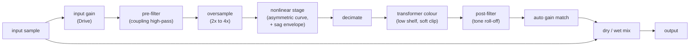

# Analog emulation: tube and transistor "euphonics"

Research summary and an itemized plan for adding tube and transistor
character to the PCM playback chain. Branch: `analog-poc`. Status: **research
and plan only. Nothing is implemented.**

Written for the Kahawai maintainers. Related: [Backlog.md](Backlog.md)
(DSP effects section), [EQ.md](EQ.md) (pipeline and the `DspStage` idea).

How to read the claims below:

- **[cited]** comes from a source in section 9, found in this research pass.
  I read the search summaries, not the full papers, so treat details as
  leads to confirm in Phase 0.
- **[known]** is general audio-DSP background I am confident of but did not
  source here.
- **[guess]** is my estimate and must be measured before it is relied on.

---

## 1. Goal and non-goals

**Goal:** an optional, subtle "warmth" stage in the shared PCM path that
can be switched among a few flavours (tube and transistor), with a drive
control and a dry/wet mix, sounding good on music at normal listening
levels and costing little CPU.

**Non-goals:**
- Not circuit-accurate emulation of a specific product. We model
  *character* (harmonics, level-dependent softness, a little dynamics), and
  name presets as flavours, not brands.
- Not a guitar-amp simulator (no tone stacks, cabinets, heavy clipping).
- Not on the exclusive paths: DoP and bit-perfect playback bypass it, as
  they do EQ, loudness and volume.

---

## 2. What makes tubes and transistors sound different (the target)

All **[known]** unless marked:

| Trait | Typical tube behaviour | Typical transistor / op-amp behaviour |
|---|---|---|
| Harmonic balance | A single-ended triode stage is asymmetric: mostly **2nd harmonic** (even), then 3rd, falling off smoothly | Symmetric clipping: mostly **3rd and other odd** harmonics; can be very clean below clipping |
| Onset | Distortion rises gradually with level ("soft knee") | Very low distortion until the rail, then an abrupt knee (hard clipping) |
| Dynamics | Power-supply sag and recovery compress loud passages slightly | Stiff supplies: little sag |
| Low end | Output transformer saturates at low frequencies and loud levels, rolls off the extremes | Direct coupled, or transformer in classic console preamps |
| Grid current | Positive grid drive draws current and clips hard on that side (**[cited]**: the Koren model includes a grid-cathode diode) | n/a |

At music levels the audible effect is a **low-order harmonic colouring that
grows with level**, plus mild compression. Getting that right, without
aliasing, matters more than circuit detail.

---

## 3. Research findings

### 3.1 Modelling approaches, from cheap to expensive

| Approach | What it is | Fit for us |
|---|---|---|
| **Static waveshaper** with asymmetry and filters around it | A memoryless curve (tanh, polynomial, or a table) placed between pre- and post-filters. The classic "tubes as filters + waveshapers" approach (**[cited]**: described as a common approach in the DAFx literature) | **Best first step.** Cheap, controllable, easy to test |
| **Fitted tube curve** (Koren) | Norman Koren's phenomenological triode equations fit datasheet curves well (**[cited]**). A 12AX7 parameter set: mu about 100, Ex about 1.39, Kg1 about 1652, Kp 1000, Kvb 524 (**[cited]**, from a search result; confirm against Koren's page). Most physically informed tube simulations still use Koren's or Cardarilli's model (**[cited]**) | **Phase 2.** Use it to *derive* the static curve and its asymmetry, and to build a lookup table; do not solve the circuit per sample at first |
| **Wave digital filters (WDF)** | Simulates the whole stage (tube plus resistors and capacitors) with one nonlinear element solved without iteration. Well studied for triode stages (**[cited]**: Pakarinen and Karjalainen's enhanced WDF triode; the RT-WDF library) | A possible later upgrade (Phase 5). More faithful, more code and CPU |
| **State-space / SPICE-style solvers** | Newton iteration per sample | Too heavy and fragile for a background playback thread |
| **Neural black-box models** | Learn a device from recordings (**[cited]**: a 2018 paper on tube amplifier emulation) | Needs data and training tooling; hard to keep light and deterministic. Not for a first version |

### 3.2 Aliasing is the main quality risk

A nonlinearity creates harmonics above the original band. Without
protection they fold back below Nyquist as inharmonic, harsh distortion.
Two families of fixes:

- **Oversampling** (2x to 8x around the nonlinear part, with good
  anti-alias and decimation filters). Robust and simple to reason about.
  Costs CPU in proportion to the factor, and adds latency with linear-phase
  filters (**[known]**).
- **Antiderivative antialiasing (ADAA)**, introduced by Parker, Zavalishin
  and Le Bivic (DAFx 2016) and developed by Bilbao, Esqueda, Parker and
  Välimäki (**[cited]**). It reduces aliasing without oversampling, for
  memoryless nonlinearities. It needs the antiderivative of the curve
  (closed form for tanh and hard clip). There are extensions to stateful
  systems (**[cited]**). Often combined with a small oversampling factor.

Our sources are 44.1 to 192 kHz. Content at 96 kHz and above has a lot of
headroom already, so the required oversampling depends on the source rate:
**[guess]** 4x at 44.1/48 kHz, 2x at 88.2/96 kHz, none or ADAA-only above.
Confirm by measuring aliasing (section 6).

### 3.3 Output transformer and power-supply sag

- Transformer saturation and hysteresis are usually modelled with the
  Jiles-Atherton theory (**[cited]**), which is accurate but implicit and
  hard to fit and run in real time (**[cited]**). Cheaper alternatives are a
  level-dependent low-shelf plus a soft clip, or a small hysteresis-like
  state (**[known]**). Start with the cheap version.
- Sag can be modelled as a slow (tens of milliseconds) envelope of the
  signal that lowers the stage's supply, which lowers headroom and gain
  (**[known]**). It is a control-rate effect and cheap.

### 3.4 Existing implementations (license matters)

- **libmksim** (Rust, WDF, models tubes, diodes, transistors, op-amps; MIT
  licensed, per its README as summarised in search) (**[cited]**). Worth a
  code read as a reference, and possibly a dependency. Check maturity and
  maintenance before relying on it.
- **RT-WDF** (C++ WDF library, open source) (**[cited]**). License not
  checked.
- Some well-known open-source emulations are GPL (**[known]**, not checked
  for any specific project). Rule from the Backlog: do not copy code from
  a project until its license is confirmed compatible.

---

## 4. Proposed design

### 4.1 Where it lives

- A new module `analog.rs` in
  [kahawai-player-core](crates/kahawai-player-core/src/) (pure Rust, no
  platform imports, like `dsp.rs`).
- A small trait so stages compose (this is the `DspStage` idea from
  EQ.md):

```rust
pub trait DspStage: Send {
    fn prepare(&mut self, sample_rate: u32, channels: u16);
    fn process(&mut self, interleaved: &mut [f32]);   // in place
    fn latency_frames(&self) -> u32 { 0 }
    fn reset(&mut self);
}
```

- Chain order in `pump_pcm` (see [engine.rs](crates/kahawai-player-core/src/engine.rs)):
  decode, resample, **EQ, analog stage**, loudness gain, volume, sink. The
  analog stage goes after the EQ so the user's EQ shapes what is driven,
  and before loudness and volume so drive is independent of listening level.
  (Open question Q3.)



### 4.2 Controls

| Control | Meaning | Range |
|---|---|---|
| **Flavour** | Selects a preset set of the parameters below | see 4.3 |
| **Drive** | Input level into the nonlinearity | 0 to 100 percent |
| **Mix** | Parallel blend of the dry signal | 0 to 100 percent, default about 30 to 50 |
| **Output** | Level trim (auto gain-matched by default) | plus or minus a few dB |
| (advanced, later) Bias / asymmetry, Sag, Tone | Expose only if useful | |

Defaults must be conservative: a subtle change, never louder than dry.

### 4.3 Flavour presets (names describe character, not brands)

| Flavour | Character | Main ingredients |
|---|---|---|
| **Warm triode** | Soft, even-harmonic warmth | Asymmetric curve derived from a high-mu triode, gentle sag, light transformer colour |
| **Push-pull tube** | Fuller, slightly compressed | Symmetrical stage (odd bias with some even), more sag, more transformer colour |
| **Solid-state console** | Clean, punchy, a little edge at high drive | Symmetric soft curve with a slightly sharper knee, no sag, light transformer colour |
| **Hard transistor** | Aggressive, for effect | Symmetric hard-ish clip with ADAA |

Inspired-by references (for our own measurement targets only, not for the
UI): single-ended triode line stages, push-pull power stages, classic
transformer-coupled console preamps. Final list to be chosen in Phase 0.

---

## 5. Itemized plan

Sizes: **S** an hour or two, **M** a day, **L** several days. Each phase ends
with something we can listen to and a green test suite.

### Phase 0: research and decisions (M) *(this document is the start)*

| # | Item | Output |
|---|---|---|
| 0.1 | Read the key sources in section 9 in full (Koren tube models, ADAA, WDF triode, transformer emulation) and confirm the parameter values | Notes appended here |
| 0.2 | Choose reference behaviours: target harmonic profiles (2nd/3rd/5th versus drive level) for each flavour, from published measurements | A table of targets |
| 0.3 | Check libmksim and RT-WDF: maturity, maintenance, license, API fit | Use / read-only reference / skip decision |
| 0.4 | Measure the CPU budget: cost of the current chain per chunk at 192 kHz stereo, and the headroom left on this Mac | A number to design against |
| 0.5 | Decide the open questions in section 7 | Decisions recorded |

### Phase 1: the seam and a working static stage (M to L)

| # | Item | Notes / acceptance |
|---|---|---|
| 1.1 | Extract the `DspStage` trait; make `ParametricEq` implement it | No behaviour change; all existing tests pass |
| 1.2 | `AnalogStage`: input gain, asymmetric waveshaper (tanh-family with a bias term), dry/wet mix, auto gain match | Bypass is bit-transparent when off or mix is 0 |
| 1.3 | Oversampling wrapper: polyphase half-band FIR, 2x and 4x, built once and reused | Aliasing test (6.2) passes |
| 1.4 | Fade-in/out on parameter change and on/off (reuse the EQ's approach) | No click test passes |
| 1.5 | Wire into `pump_pcm` after the EQ; PCM shared path only; DoP and bit-perfect bypass | Engine test mirrors `dop_bypasses_dsp_entirely` |
| 1.6 | Engine command, snapshot fields and settings persistence (`engine-settings.json`) | Round-trip test |

### Phase 2: derive curves from tube models (M)

| # | Item | Notes / acceptance |
|---|---|---|
| 2.1 | Offline tool (a Rust test or example) that evaluates the Koren triode equations and produces a normalized transfer curve for a chosen tube and load line | Curve plot and a stored table per flavour |
| 2.2 | Replace the hand-made curves with table lookups (interpolated) for the tube flavours | THD profile within tolerance of the targets (0.2) |
| 2.3 | Add ADAA for the table curves (or a smooth closed-form fit with a known antiderivative) so the oversampling factor can drop | Aliasing and CPU comparison recorded |

### Phase 3: dynamics and transformer colour (M)

| # | Item | Notes / acceptance |
|---|---|---|
| 3.1 | Sag: slow envelope follower that lowers headroom and gain, with attack and recovery | Level-dependent gain drop matches the flavour target |
| 3.2 | Transformer colour: cheap level-dependent low shelf plus soft clip; evaluate a hysteresis state as a follow-up | Bass tone THD rises with level and falls with frequency, as intended |
| 3.3 | Tone shaping: coupling and roll-off filters per flavour | Frequency response within a stated tolerance |

### Phase 4: UI (M)

| # | Item | Notes / acceptance |
|---|---|---|
| 4.1 | "Warmth" button next to the EQ button, opening a modal in the EQ dialog's style | Same look, both themes |
| 4.2 | Flavour picker, Drive, Mix, Output; live preview with OK / Cancel, like the EQ | Cancel reverts |
| 4.3 | Dim with "not supported for this stream type" on exclusive paths | Same rule as the EQ |
| 4.4 | Guardrails: limit drive, warn when the stage will clip the output; gain-matched A/B toggle | Consistent with the EQ guardrails |
| 4.5 | Tests: component, store, and a house-style check | Green |

### Phase 5: optional higher fidelity (L, only if Phases 1-4 are not enough)

| # | Item | Notes |
|---|---|---|
| 5.1 | WDF-based triode stage (or libmksim) for one flavour | Compare against the table version by ear and measurement |
| 5.2 | Jiles-Atherton transformer for one flavour | Only if the cheap version is clearly lacking |
| 5.3 | Move the EQ, analog and future stages into a small chain editor | Backlog: "Effects chain UI" |

---

## 6. Verification plan

Everything is deterministic DSP, so most of it is testable in Rust without
listening. Listening tests still decide "does it sound good".

1. **Harmonic profile.** Feed a 1 kHz sine at several levels, take an FFT,
   and check the 2nd, 3rd and 5th harmonic levels versus drive against the
   flavour's targets (tolerance in dB).
2. **Aliasing.** Feed a high-frequency sine (for example 15 to 20 kHz at
   44.1 kHz) hard, and check that no inharmonic component rises above a
   threshold below the fundamental. Run at 44.1, 96 and 192 kHz. Compare
   oversampling factors and ADAA.
3. **Transparency.** With the stage off, or mix 0, the output equals the
   input bit for bit. At low drive and low levels, distortion stays below a
   stated figure.
4. **No clicks.** Change parameters and toggle the stage while a tone
   plays; measure the largest sample-to-sample jump, as in the EQ tests.
5. **Level and gain match.** Loudness of the wet and dry signal within
   about 1 dB at default settings.
6. **Path rules.** DoP and bit-perfect output are bit-identical with the
   stage enabled (as the existing DoP test does for the EQ).
7. **Performance.** Cost per chunk at 44.1 and 192 kHz stereo stays under a
   set share of the chunk's real-time duration (budget from item 0.4).
8. **Listening.** A/B on a fixed set of tracks (acoustic, vocal, dense rock,
   electronic) with gain matching, before merging each phase.

---

## 7. Open questions (decide in Phase 0)

- **Q1. Which stages to offer first?** All four flavours in 4.3, or one
  tube and one transistor flavour?
- **Q2. Oversampling or ADAA first?** Oversampling is simpler and more
  robust; ADAA saves CPU. Plan: oversampling in Phase 1, ADAA in Phase 2.
- **Q3. Where in the chain?** After the EQ and before loudness and volume
  (proposed), or after loudness? It changes how drive relates to level.
- **Q4. Latency.** Linear-phase oversampling filters add a fixed delay
  (a few milliseconds). Accept it and compensate in the playhead, or use
  minimum-phase filters?
- **Q5. Gain match.** Automatic (safer for A/B) or manual?
- **Q6. libmksim.** Dependency, reference, or ignore?
- **Q7. Naming and legal.** Preset names describe character; confirm we are
  comfortable with "inspired by" notes in documentation only.

---

## 8. Risks

| Risk | Mitigation |
|---|---|
| CPU cost at 192 kHz stereo on the playback thread | Measure first (0.4); reduce oversampling at high rates; ADAA |
| Aliasing sounds harsh | Aliasing tests (6.2) gate every phase |
| "Warmth" is subjective and easy to overdo | Conservative defaults, gain-matched A/B, clip warning |
| Clipping past 0 dBFS (no limiter in the chain today) | Auto gain match, drive limits, and the headroom item in the Backlog |
| Licence contamination from borrowed code | Own implementations from papers; license check before reuse |
| Model accuracy claims | We claim character, not fidelity to a named product |

---

## 9. Sources

Found in this research pass (search summaries read; confirm in full in
Phase 0.1):

- Koren, "Improved vacuum tube models for SPICE simulations":
  [part 1](https://www.normankoren.com/Audio/Tubemodspice_article.html),
  [part 2](https://www.normankoren.com/Audio/Tubemodspice_article_2.html)
- [Nonlinear SPICE models of vacuum-tube triodes (Electronic Design)](https://www.electronicdesign.com/technologies/analog/article/55246421/modeling-on-mondays-nonlinear-spice-models-of-vacuum-tube-triodes-part-3)
- [Measures and models of real triodes, for the simulation of guitar amplifiers](https://www.researchgate.net/publication/281075913_Measures_and_models_of_real_triodes_for_the_simulation_of_guitar_amplifiers)
- [A quadric surface model of vacuum tubes for virtual analog (DAFx 2023)](https://dafx.de/paper-archive/2023/DAFx23_paper_15.pdf)
- [New family of wave-digital triode models (Aalto)](https://aaltodoc.aalto.fi/bitstreams/c94fca6e-463e-4f8e-a25d-9dce4aa4e8c8/download)
- [Enhanced wave digital triode model for real-time tube amplifier emulation (IEEE)](https://ieeexplore.ieee.org/document/5272282/)
- [A Csound opcode for a triode stage of a vacuum tube amplifier (DAFx 2011)](http://recherche.ircam.fr/pub/dafx11/Papers/42_e.pdf)
- [RT-WDF: modular wave digital filter library (DAFx)](https://www.dafx.de/paper-archive/details/ilZF4akpmSxzyiusoAOolg)
- [libmksim (Rust, MIT): real-time circuit simulation for audio DSP](https://github.com/mkaudio-company/libmksim)
- Antialiasing: Parker, Zavalishin, Le Bivic, "Reducing the aliasing of
  nonlinear waveshaping using continuous-time convolution" (DAFx-16);
  Bilbao, Esqueda, Parker, Välimäki, "Antiderivative antialiasing for
  memoryless nonlinearities" (IEEE SPL 2017); see also
  [the companion code](https://github.com/julian-parker/DAFX-AntiAliasing),
  [antiderivative antialiasing for stateful systems](https://www.hsu-hh.de/ant/wp-content/uploads/sites/699/2020/10/DAFx2019_paper_4.pdf),
  and [practical considerations for ADAA](https://jatinchowdhury18.medium.com/practical-considerations-for-antiderivative-anti-aliasing-d5847167f510)
- Transformers: [a transformer model based on the Jiles-Atherton theory](https://www.researchgate.net/publication/270465159_A_transformer_model_based_on_the_Jiles-Atherton_theory_of_ferromagnetic_hysteresis),
  [real-time audio transformer emulation for virtual tube amplifiers](https://www.researchgate.net/publication/220057543_Real-Time_Audio_Transformer_Emulation_for_Virtual_Tube_Amplifiers)
- [Deep learning for tube amplifier emulation](https://arxiv.org/pdf/1811.00334)
