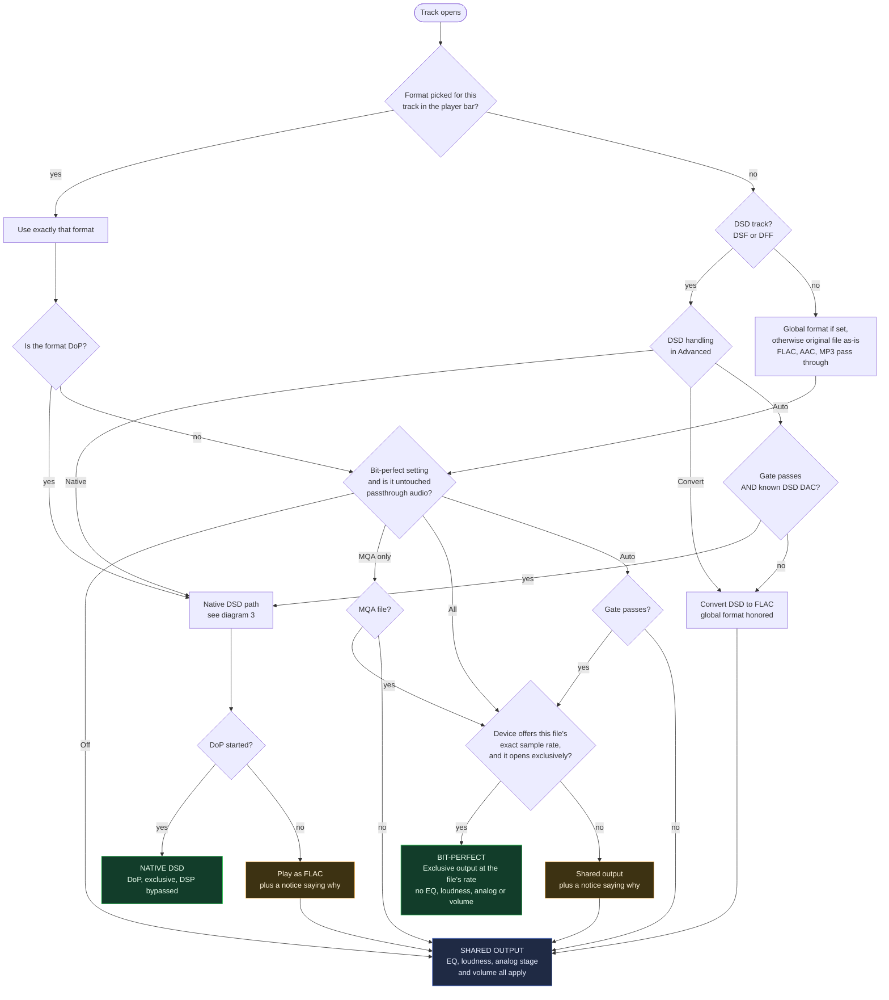
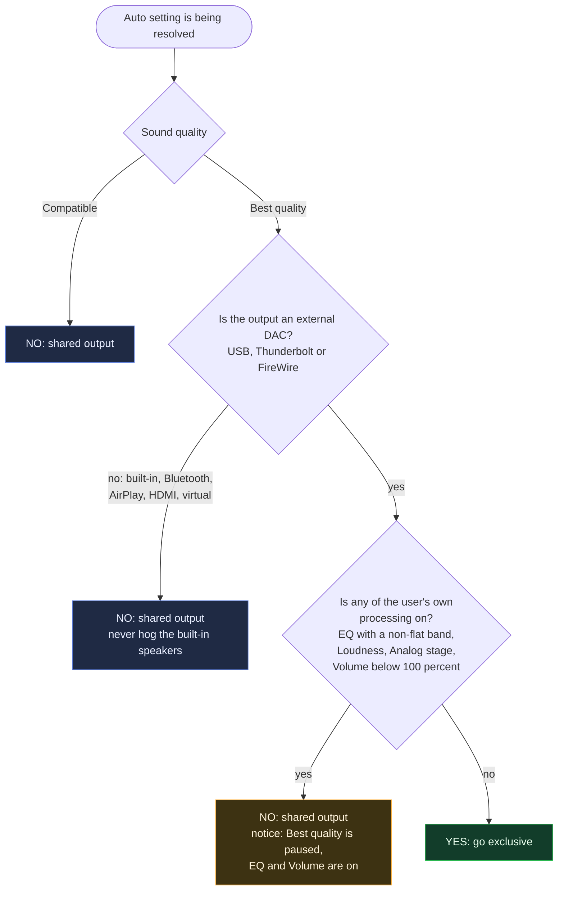
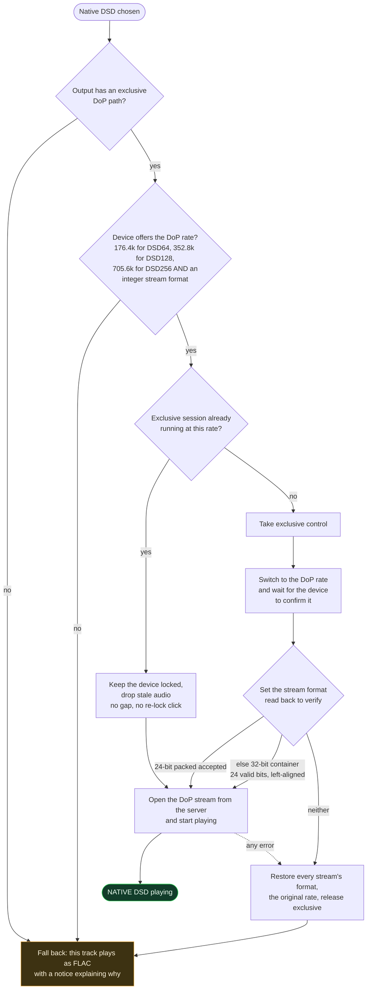

# Audiophile Mode

Audiophile Mode is what the Settings screen calls **Best quality**: bit-perfect playback at each file's own sample
rate, and native DSD, whenever the output device can do it, with an automatic fallback whenever it can't. This
document explains the thinking behind the Settings screen first, then the decision tree the player follows for every
track.

## Philosophy: negotiate, don't configure

The goal is the best possible sound with as little fiddling as possible. The player already knows two things the
user would otherwise have to work out and keep in sync by hand: what the **file** is (format, sample rate, DSD or
PCM) and what the **device** can do (connection, rates, bit depths, DSD). So the Settings screen is built on seven
ideas.

1. **One decision, not six.** The user makes a single top-level choice, *Best quality* or *Compatible*. Stream
   format, DSD handling and bit-perfect used to be separate settings that interacted in ways nobody could predict. A
   stray "Passthrough" could silently defeat "Native DSD". Now they are secondary, and each defaults to **Auto**,
   which follows the top-level choice.
2. **The player negotiates per track.** Each track is matched against the current device. A 96 kHz FLAC and a
   44.1 kHz MP3 can take different paths in the same queue, and nothing needs reconfiguring between them.
3. **Show what the device can do, at a glance.** The Audio output section lists every standard sample rate, bit depth
   and DSD rate the device offers. Anything unsupported is dimmed and struck through. The user never has to guess
   whether a DAC handles 192 kHz or DSD128, because it is the device's own report.
4. **Never leave a silent failure.** If the best path can't be used, the track plays on the next-best path and the
   player says why in a one-line notice ("Played as PCM (FLAC): the device refused DoP", "Best quality is paused: EQ
   is on"). Playback does not stop over a preference.
5. **Yield to the user's own choices.** EQ, loudness, the analog stage and software volume are things the user turned
   on deliberately, and exclusive output bypasses all of them. Best quality therefore steps aside while any of them
   is on, and a legend shows each one as *on*, *off* or *bypassed*. The system never silently overrides what the user
   asked for.
6. **Be conservative where the failure is loud.** Exclusive output takes over a device, and DSD sent to a DAC that
   doesn't decode it plays as full-scale noise. So Best quality only takes an *external DAC* exclusively (never the
   built-in speakers), and only plays DSD natively on a DAC that is *known* or *confirmed by the user* to decode it.
   A device offering 176.4 kHz is not proof that it decodes DoP.

Anything the automation gets wrong can be overridden. **Advanced** holds the individual controls. An explicit value
there always beats the mode, and the section shows an "N overrides" badge when it is doing so.

7. **Show the signal path live.** A panel pinned to the top of Settings puts the **media file** and the **output
   device** side by side, so the user can watch a change take effect. The file column shows bit depth, sample rate
   and the same `original → converted → output` tag as Now Playing. The device column shows bit depth, sample rate
   and mode (PCM, DSD over DoP, MQA stream, shared or exclusive). The device values are read from the OS about once
   a second, not from what the player intended, so they are what the DAC is actually running. Between the columns, a
   marker per row says how the two relate: **=** matched (nothing resampled), **→** carried natively (DSD inside DoP
   frames), **≠** converted (resampled, or DSD turned into PCM).

### The Settings screen

| Section | What it is for |
|---|---|
| **Signal path** *(pinned at the top)* | Live media-file and output-device readout, side by side, with matched, carried or converted markers between them. |
| **Audio output** | Pick the device. Below it, the capability panel (connection, sample rates, bit depth, DSD/DoP) and a switch to confirm an unlisted DAC decodes DoP. |
| **Sound quality** | The one choice: *Best quality* or *Compatible*. A live status line says what is happening now ("Ready", "Playing bit-perfect at 96 kHz", "Paused: EQ is on"). A legend shows EQ, Loudness, Analog and Volume as on, off or bypassed. |
| **Parametric EQ** and **Loudness normalization** | Your own processing. Both are bypassed, and shown dimmed, while exclusive output plays. |
| **Advanced** *(collapsed)* | Stream format, Bit-perfect output and DSD handling. Each defaults to *Auto (follows Sound quality)*. |
| **Experimental** *(collapsed)* | Work-in-progress features, currently Analog Warmth. The collapsed header shows "Analog warmth on" while the effect is active, so it is never hidden. |

The library is mostly FLAC, AAC and MP3, so the ordinary PCM path matters most. DSD is the special case, and it is
gated more strictly because getting it wrong is louder.

## The decision tree

### 1. What happens to each track

This runs every time a track opens, including on skips, seeks and device changes.

### 2. The gate: should an *Auto* setting go exclusive right now?

Every **Auto** in the tree above asks this one question. It is the heart of Audiophile Mode. There is one rule, in
one place in the engine.

For **DSD** the gate has one more condition, checked separately in diagram 1: the device must be **known** to decode
DoP. That means it is on the built-in list (currently the FiiO K15), or the user switched on "This output decodes
DoP" in Audio output.

### 3. Starting native DSD, and falling back

DoP packs the 1-bit DSD stream into 24-bit PCM frames, so the DAC has to receive the frames untouched. Each step is
verified by reading the device back, and any failure at any step drops this one track to FLAC.

## What the user sees

| Situation | What appears |
|---|---|
| Best quality, external DAC, nothing bypassed | Status: "Ready: tracks will play bit-perfect at their own sample rate." Player bar shows **Bit-perfect** or **Exclusive DoP**. |
| Playing exclusively | Status: "Playing bit-perfect at 96 kHz." EQ, Loudness, Analog and Volume are dimmed and marked *bypassed*. |
| EQ (or Loudness, Analog, Volume below 100%) is on | Status: "Paused: EQ is on. Turn it off for bit-perfect output." The item is marked *on*. Everything plays on shared output with the processing applied. |
| Built-in speakers or Bluetooth selected | Status: "This output isn't an external DAC, so Best quality stays on shared output." |
| DoP or exclusive output failed | Notice bar: "Played as PCM (FLAC): …" or "Played on shared output: …", with the device's reason. |
| The chosen output isn't connected | Notice bar: "“FIIO K15” isn't connected, so this is playing on “MacBook Pro Speakers”." The choice is kept, and the device is used again as soon as it is back. |
| The DAC disappears mid-track | The track carries on from the same spot on shared output, with a notice ("The exclusive output stopped … continuing on shared output"). It doesn't try exclusive again for that track. |
| Compatible | Status: "Shared output. EQ, loudness and volume all apply." DSD is converted to FLAC. |

## Notes on what "bit-perfect" means here

- **FLAC (and other lossless):** exclusive output at the file's own sample rate. No resampling, no EQ, no
  loudness gain and no software volume. The samples the file holds are the samples the DAC receives.
- **AAC and MP3:** decoded, then sent exclusively at the file's sample rate. This avoids resampling, but the audio
  was already lossy, so it is "no further changes", not "untouched".
- **DSD:** native DoP over PCM, or converted to FLAC 24-bit at 88.2 kHz where DoP isn't available.
- **Loudness normalization and headroom (shared output):** the gain is planned against the track's real peak and the
  EQ's worst-case boost, so the result stays about 1 dB below full scale instead of being clipped by the device. If a
  track is peaky enough, it plays a little quieter than the target rather than distorting. A soft guard bends whatever
  still exceeds full scale as a last resort.
- **Volume:** exclusive output has no software volume. Use the DAC's own control. This is why Volume below 100% makes
  Best quality step aside instead of quietly ignoring the slider.

## Device negotiation details

- **Rates:** the capability panel reads the device's nominal rates. Devices apply a rate change asynchronously (the
  K15 takes a few hundred milliseconds), so the player waits for confirmation instead of trusting an immediate
  read-back.
- **Bit depth:** a device that lists only 16-bit and 32-bit integer formats (XMOS XU316 firmware, such as the FiiO K15)
  carries 24-bit audio in a 32-bit slot. The player uses that automatically, and the panel counts 24-bit as
  available.
- **IO buffer format:** the format we set for the hardware (the *physical* format) is not necessarily the format of
  the buffers our render callback fills (the *virtual* format). On the K15 the virtual format is fixed at Float32
  and the driver converts to the 32-bit integer the DAC takes. The player reads the virtual format back after
  configuring the device and renders in that layout. Each 24-bit sample (including DoP words) is scaled by exactly
  2^-23, which is exact in Float32 and converts back to the identical integer, so it stays bit-perfect. Writing
  integers into a Float32 buffer plays as loud noise, which is what happened on the second track of an album before
  this was checked.
- **DoP markers:** the renderer owns the marker phase. Every DoP frame, audio or silence, gets the next marker in the
  strict 0x05 / 0xFA alternation, so a track boundary can never break it (a break makes the DAC drop out of DSD mode).
- **Restoring the device:** on release, every stream's original format and the original rate are put back, and only
  then is exclusive control dropped. Otherwise a DAC can stay pinned at 176.4 kHz for other apps.
- **Gapless and seeks:** while consecutive tracks share a rate and channel count (for bit-perfect PCM and for DoP), the
  exclusive session stays open and the device stays locked. Only the stale audio is dropped, so the next track opens in
  milliseconds instead of re-acquiring the device (about 1.7 s on the K15).
- **Switching back to shared output** releases the exclusive device so other apps can use it again.

## Migration

Settings written before Sound quality existed are reset once: DSD handling, Bit-perfect and Stream format go back to
*Auto*, and the chosen output device is kept. Explicit choices made afterwards are respected.

## Known limits

- The known-DAC list is deliberately short (FiiO K15). Other DACs use the "This output decodes DoP" switch.
- Native DoP audio has been exercised through the negotiation, format and restore steps on real K15 hardware, and
  through unit tests of the render path. It has not yet been verified by ear on that DAC.
- Exclusive output is macOS-only for now. Other platforms always use shared output.
- Bluetooth, AirPlay, HDMI and virtual devices are never taken exclusively by Best quality. An explicit *All tracks*
  in Advanced can still do it.
