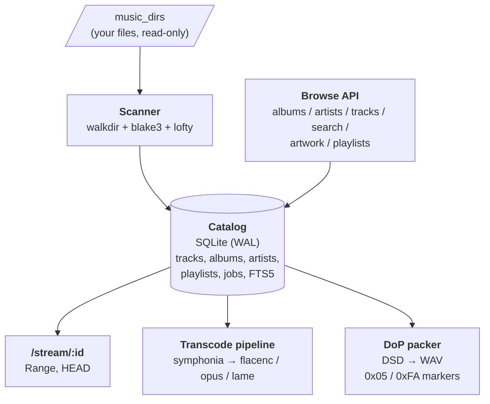
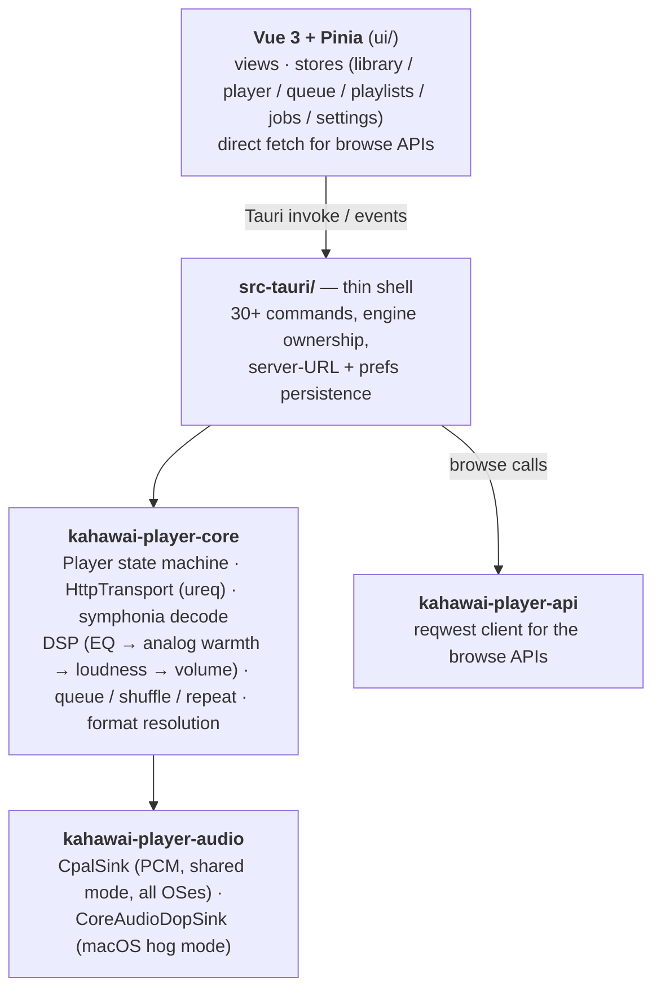

# Kahawai — Design Specification (v1)

*2026-09-25. Formal specification for **Kahawai Server** and **Kahawai Player**. This document states the
philosophy, the architecture, and the long-term considerations.*

*Reading guide: `kahawai-server-spec.md` and `kahawai-player-design.md`
are the build records — written as the work happened, with stories, phases,
and resolved decisions. This document is the durable specification: what the
system is, why it is shaped this way, and where it is allowed to go next.
`README.md` (both roots) covers operation and library choices; `Roadmap.md`
lists future enhancements.*

---

## 1. Philosophy

Seven principles govern every design decision. When two principles conflict,
the earlier one wins.

### 1.1 Your library, your machine

The system is self-hosted by construction: no cloud, no accounts, no
telemetry, no phone-home. The server runs on hardware you own, serves your
files over your LAN, and the client plays them back. Anything that would
require trusting a third party with your library is out of scope.

### 1.2 The scanner is read-only; the library is never modified

Scanning computes identity (BLAKE3), reads metadata (lofty), and extracts
artwork — it never writes to, moves, or renames your files. Missing files are
flagged in the catalog, never deleted from it (relink-friendly). This is a
trust invariant, not a convenience: the day the server "organizes" your files
is the day you stop trusting it.

### 1.3 Honest engineering — never fake a capability

A feature that isn't built must say so, precisely. Disabled encoders answer
`501` naming the cargo feature that enables them. The SACD extractor fails
with a message naming the missing `sacd_extract` integration instead of
silently doing nothing. Fallbacks (DSD→PCM when the DAC can't do DoP) are
logged with the reason. UI surfaces server limitations verbatim rather than
hiding them. Test-pinned behaviors (e.g. headerless DoP seek responses) are
documented as contract, not smoothed over. Guesses are marked as guesses.

### 1.4 Bit-perfect where it matters, pragmatic everywhere else

The DoP path is bit-perfect by construction: exclusive device access,
verified sample rate, no DSP, no volume, no resample — because a single
altered bit breaks DSD-over-PCM framing. PCM playback defaults to shared
mode, resamples only when the device demands it, and applies DSP only where
the user asked. Audiophile rigor is spent on the paths where it is audible
or structural, not as a blanket tax on everything.

### 1.5 Performance is a feature, stated in concrete terms

Streaming is constant-memory (bounded chunks, backpressure channels) — a
200 MB DSF costs the same footprint as a 3 MB MP3. Decode never runs on a
real-time audio callback; the callback only drains a lock-free ring.
Loudness pre-scan doubles first-play LAN bandwidth and the docs say so
instead of letting you discover it. Numbers are preferred over adjectives.

### 1.6 Spec-first, phase-gated

Stories are specified before they are built (S1–S13, C1–C3). A phase is done
only when `cargo check` shows zero warnings, the full test suite is green,
`clippy -D warnings` is clean, and `cargo fmt` is applied. The gates are what
make a one-person-plus-agent project sustainable: nothing lands half-tested.

### 1.7 The mobile bet

`kahawai-player-core` — engine, queue, DSP, transport — has zero Tauri imports and
zero platform imports. All OS audio lives behind the `AudioSink` trait in
`kahawai-player-audio`. This is not abstraction for its own sake: it is the
architectural wager that v2 iOS/Android apps are a platform shell plus an
audio-output swap, not a second app. Anything that violates the boundary
gets flagged in review.

---

## 2. Architecture — server

### 2.1 Component map

- **Scanner** (§3.1 of the build record): two-phase walk (count, then scan),
  per-track transactions, streaming BLAKE3, lofty tags + technical
  properties, artwork extraction deduplicated by hash, FTS5 index updates,
  scan logs. Incremental rescans key on path/size/mtime: unchanged files are
  skipped, changed files re-hashed and updated, missing files flagged.
  DSF/DFF/ISO are cataloged with `decodable=false` and nullable technical
  fields — browsable, not playable.
- **Catalog**: SQLite in WAL mode. Album identity is the `(title,
  album-artist)` heuristic with a Various-Artists rule — simple, wrong in
  known edge cases, documented as such (MusicBrainz IDs are the v2 answer).
- **Streaming**: full HTTP Range semantics (`200`/`206`/`416`, suffix and
  open-ended ranges; multi-range rejected). Three query dimensions compose
  orthogonally: `?format=` (rendition), `?seek_ms=` (transcode-side seek),
  `?next=` (gapless chaining). `HEAD` mirrors `GET` metadata. Response
  headers are part of the contract: `X-Transcode-Chain`,
  `X-Gapless-Next`, `X-Gapless-Mode`.
- **Transcode pipeline**: symphonia decodes any source to f32 PCM; DSD
  sources go through the in-house FIR decimator (Kaiser-windowed sinc;
  DSD64→88.2 kHz, DSD128/256→176.4 kHz; sample-exact seek via phase-aligned
  warm-up); encoders are FLAC (pure-Rust `flacenc`), Opus and MP3 behind
  default-off features with bundled C sources. Lossy targets get cubic
  resampling to the encoder's native rate; FLAC preserves the source rate.
- **DoP packer**: DSD frames packed into 24-bit LE PCM (payload in the low
  16 bits, alternating `0x05`/`0xFA` marker byte) inside a 44-byte WAV
  header; marker parity survives chunking and seeking. Seek responses are
  the raw payload suffix *without* a WAV header — pinned by tests, handled
  explicitly by the client.
- **Jobs**: SQLite-persisted (`003_jobs.sql`). Restart recovery rule: any
  `queued`/`running` job becomes `failed` with `error = "server restarted"`.
  Scans run as jobs with live progress. The ISO extractor validates the
  path and then fails honestly until `sacd_extract` is integrated.
- **Hardening (S10)**: every served file is canonicalized and must stay
  under a configured music dir (symlink escapes → `404`); artwork hashes
  must be hex (`400`); JSON/import bodies capped at 10 MiB (`413`); API
  routes time out at 60 s (`408`, streams exempt); graceful shutdown on
  SIGTERM/SIGINT; the trusted-LAN/no-auth warning prints at startup and in
  the README.

### 2.2 Data flow: one stream

`GET /stream/42?format=flac&seek_ms=30000` with no local file changes:

1. Router resolves track 42 → path, validates the path stays under a music
   dir, checks `decodable`.
2. The ladder resolves `flac` explicitly (or `passthrough` by default, or
   FLAC fallback for DSD/unknown, or DoP for `native` story + DSD source).
3. `PreparedTranscode::setup` opens the source (symphonia or DSD decimator),
   applies the sample-exact seek, selects encoder + resampler.
4. A bounded channel bridges the blocking encode loop to the async response
   body — backpressure, not buffering.
5. Headers (`X-Transcode-Chain`, content type) go out; bytes stream until
   EOF or client disconnect.

Nothing is written to disk at any point. Transcodes are pure functions of
(track, format, seek) — which is what makes the client's loudness pre-scan
deterministic.

### 2.3 What the server deliberately does not do

No authentication, no TLS, no rate limiting (v2). No DRM. No file
organization or tag writing. No loudness metadata (yet — see §4.3). No
internet exposure, ever, in v1.

---

## 3. Architecture — client

### 3.1 Layer map

The split is deliberate: **the webview never streams audio** — playback
state lives in Rust, Pinia mirrors it via `player-state` events (~4 Hz,
immediate on changes) plus a direct `get_state` on launch. Browse/read APIs
go directly from Vue to the server over HTTP (no auth in v1, so no secret
needs protecting); only playback crosses the Tauri bridge.

### 3.2 The two audio paths

**PCM (shared mode).** `CpalSink` opens the default device at the
track-native rate when supported; the engine resamples (cubic) only
otherwise. Chain order is fixed and visible in the UI's audio-path badge:

`decode → resample (if needed) → EQ → analog warmth (optional) → loudness → volume → sink`

The audio callback never blocks or allocates: it drains a lock-free
(`ringbuf`) SPSC ring the decode thread feeds, fills underruns with
silence, and counts them.

**DoP (exclusive hog mode, macOS).** `CoreAudioDopSink` takes hog mode with
PID verification, switches the device's nominal rate to the exact DoP rate
(176.4/352.8/705.6 kHz), forces a 24-bit packed-integer stream format, and
**verifies both by readback** — any failure unwinds (rate restore + hog
release) and refuses. Raw DoP frames go to the DAC untouched; underruns emit
marker-correct DoP silence so the DAC never loses frame sync. The path
bypasses decode, EQ, loudness, volume, resample, and dither — enforced in
code and asserted in tests. Before opening, the engine asks the sink whether
the device reports the required rate; if not, the track falls back to
DSD→PCM/FLAC with the reason logged. The UI shows an **Exclusive DoP**
badge and dims the volume slider while active.

### 3.3 Gapless, seek, DSP — client side

- **Gapless**: the engine requests the current track with `?next=<next_id>`;
  single-session responses decode straight to EOF; chained responses detect
  the container boundary and continue into a fresh decoder with no
  dropped/added samples; fallback is sequential requests with a
  sample-accurate ring-buffer handoff. Proven by `VecSink` tests: exact
  total samples, no energy dip at the boundary.
- **Seek**: scrubbing re-requests with `?seek_ms=` (transcodes) or `Range`
  (passthrough); position is reported from decoded sample count, not
  wall-clock.
- **DSP**: 8-band parametric EQ (RBJ biquads; bypass is bit-transparent,
  asserted sample-identical) and R128-style loudness normalization
  (K-weighting, 400 ms blocks, default −14 LUFS target, +12 dB boost cap,
  smooth inter-track gain ramps). Loudness needs whole-track integrated
  loudness before playback, so v1 does a fast pre-scan pass over the
  deterministic transcode stream and caches gains in memory by
  (track id, format) — at roughly double first-play LAN bandwidth, stated
  in the UI. DoP bypasses all of it.

### 3.4 What the client deliberately does not do

No crossfade (gapless-only in v1). No remote control of other instances. No
PCM exclusive-mode toggle. No offline mode. No artwork disk cache beyond
browser HTTP caching (ETag/304). Output-device selection is display-only;
PCM always uses the system default device.

---

## 4. Shared contracts and invariants

1. **The wire contract is the API.** `kahawai-core::api` types are the single
   definition shared by server, `kahawai-player-api`, shell, and (via codegen-by-hand)
   the TypeScript types. Headers `X-Transcode-Chain`, `X-Gapless-Next`,
   `X-Gapless-Mode` are contractual, not decorative.
2. **kahawai-player-core purity.** No Tauri imports, no platform imports, no system
   audio libraries. The rule exists for the v2 mobile shells; violations are
   review-blockers.
3. **Deterministic transcodes.** The same (track, format, seek) always
   yields the same bytes. The client depends on this for loudness pre-scan
   and for seek correctness.
4. **Failure honesty.** Every degraded path names itself: `501` + feature
   name, `415` for ISO-direct, fallback logs with reasons, verbatim
   limitation messages in UI toasts.
5. **Phase gates.** Zero warnings, green suite, clean clippy, formatted —
   for every phase, both applications.

---

## 5. Long-term considerations

These are not commitments; they are the directions the architecture was
shaped to allow. Details live in `Roadmap.md`.

### 5.1 Security v2 — the one that changes the threat model

Auth + TLS is the single biggest v2 item because it unlocks everything
else: listening beyond the LAN, multiple users, remote control. The API is
already shaped for it (stateless JSON, no session assumptions), but the
hardening review must be redone from scratch — v1's "trusted LAN" posture
cannot be incrementally patched into internet exposure. Plan for a real
security pass, not a flag flip.

### 5.2 Mobile shells — the bet being protected

Tauri 2 ships iOS and Android targets; `kahawai-player-core`'s purity rule and the
`AudioSink` seam exist so v2 mobile is a shell plus platform sinks
(background audio entitlements, lock-screen controls) rather than a rewrite.
The Vue UI was componentized with responsive layout in mind for the same
reason. Offline downloads are the natural v2 mobile feature, and the server
already serves the space-efficient `?format=opus` rendition for it.

### 5.3 Catalog identity

`(title, album-artist)` plus the Various-Artists heuristic is the known weak
point. MusicBrainz-style IDs (or Discogs) would make album/artist identity
robust across re-tags and compilations. The schema can absorb an external-ID
column without disturbing the existing heuristic — run both, prefer the ID
when present.

### 5.4 Loudness as server metadata

The client's pre-scan exists only because the server doesn't know track
loudness. Computing R128 integrated loudness at scan time (or as a
background job) and serving it with the track record would delete the
double-bandwidth cost entirely and enable instant normalization. The
transcode determinism that makes client pre-scan correct today is what
makes server-side measurement trustworthy tomorrow.

### 5.5 Plugin hosting — the honest spike

VST3/AU hosting was assessed during the spec phase: no mature Rust host
crate exists, so it stays a research spike, not a roadmap promise. The DSP
chain API was still given a node-insertion shape so a future host has a
defined place to sit. If it ever happens, it happens behind the same
bit-perfect bypass guarantees DoP enjoys.

### 5.6 Format evolution

New codecs arrive through symphonia (decode) and the encoder feature flags
(encode); the transcode ladder is data, not code branching, so adding a
rendition is a ladder entry plus tests. DSD story selection (`native` vs
`convert`) already anticipates per-device capability negotiation.

---

## 6. Non-goals (restated plainly)

No cloud. No accounts. No DRM or protected-content support. No organizing
or retagging your files. No streaming-service integration. No social
features. No advertisements, analytics, or telemetry. The system plays the
music you own, on your network, as faithfully as your hardware allows —
and stays out of everything else.
