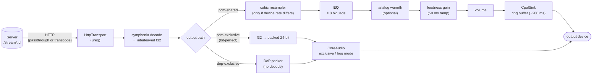
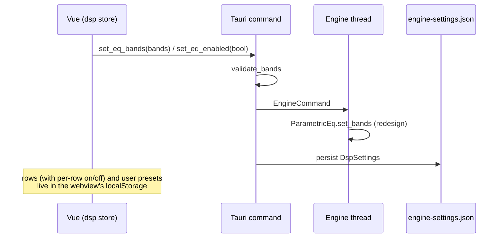
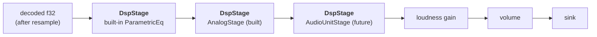

# Equalizer (EQ)

How the player's EQ works today, what it does not do, and how Audio Units
(AUs) could fit into the chain later.

Scope: `player/` (Tauri shell + Vue UI) and `crates/kahawai-player-core`,
`crates/kahawai-player-audio`. The server is not involved.

---

## 1. Summary

- The EQ runs **on the client**, in Rust, inside the playback thread. The
  server streams audio and knows nothing about EQ.
- It is a cascade of up to **8 biquad filters** (RBJ "Audio EQ Cookbook"),
  applied to decoded 32-bit float PCM, before the optional analog stage
  (see [Analog-Emulation.md](Analog-Emulation.md)), loudness gain and volume.
- It applies to the **shared PCM path only**. The exclusive paths (DoP and
  bit-perfect PCM) send samples to the DAC untouched, so EQ is bypassed and
  the UI dims the editor.
- Settings are pushed to the engine live as you edit and saved in
  `engine-settings.json`. Presets are UI-side (see 5).

---

## 2. Where the EQ sits in the pipeline



The relevant code is `Player::pump_pcm` in
[engine.rs](crates/kahawai-player-core/src/engine.rs): it decodes one chunk
(4096 frames, about 93 ms at 44.1 kHz), optionally resamples, then runs
`eq.process` → `analog.process` (optional, off by default) → `gain_ramp.apply`
→ volume → `sink.write`. The order is fixed.
The DSP itself is in [dsp.rs](crates/kahawai-player-core/src/dsp.rs), which
imports nothing platform-specific.

Everything before the sink runs on the engine's dedicated playback thread.
The audio device callback (cpal) only drains a lock-free ring buffer, so no
DSP happens on the real-time audio thread.

---

## 3. The filter chain

`ParametricEq` in dsp.rs:

| Aspect | Current behaviour |
|---|---|
| Bands | 0–8 (`MAX_EQ_BANDS`); types `peaking`, `low_shelf`, `high_shelf`, `low_pass`, `high_pass` |
| Ranges (engine) | freq 10–24 000 Hz, gain −24…+24 dB, Q 0.1–18 (shelves: slope S, clamped 0.1–3.0) |
| Frequency cap | a band is designed at no more than 0.45 × the sample rate (`usable_freq`), because the RBJ formulas degenerate near Nyquist; at 44.1 kHz the cap is 19 845 Hz |
| Maths | RBJ cookbook coefficients, normalized (a0 = 1); Direct Form II transposed, one state pair per band per channel |
| Precision | audio is f32; filter coefficients and state are f64 (at 176/192 kHz a low-frequency band needs coefficients within about 1e-3 of 1.0, which f32 handles poorly) |
| Order | bands are applied in list order (a cascade; order does not change the total response, only intermediate levels) |
| Bypass | once faded out, or with zero bands, `process` returns without touching the buffer (bit-transparent) |
| Live edits | while audio is flowing, changed bands glide to their new coefficients over about 15 ms with the filter state kept; new bands fade in from a pass-through, removed bands fade out, and turning the EQ on or off cross-fades wet/dry. Before any audio has passed (a new track or rate) changes apply at once |
| Validation | `validate_bands` rejects out-of-range values; the Tauri command validates first so the UI gets an error before anything reaches the engine |
| Rate | designed at the rate the sink receives (after any resampling) and redesigned when it changes (state is cleared) |

The frequency-response graph in the UI ([eqResponse.ts](player/ui/src/eqResponse.ts))
re-implements the same coefficient formulas, including the frequency cap,
and evaluates them at the rate the engine reports (`output_rate_hz` in the
player state). With nothing playing it draws for 48 kHz and says so.

### Guardrails in the UI

The editor only lets a band be set to something meaningful; the engine's
own validation stays as the backstop.

| Setting | UI limit | Notes |
|---|---|---|
| Frequency | 20 Hz to min(20 kHz, 0.45 × output rate) | dragging, arrow keys and typing are all clamped; typed values snap back to what was applied |
| Gain | −18…+18 dB | matches the graph's range; pass filters have no gain |
| Q | 0.1–18 | |
| Shelf slope | 0.1–3 | switching a band to a shelf pulls Q into this range |
| Bands | at most 8 | "Add band" is disabled with a tooltip |
| Headroom | warning above +0.5 dB peak boost | text explains the clipping risk; it does not change the sound |

If the output rate drops so that a saved band is now above the cap, the
band is applied at the cap and the dialog says so.

### Settings flow



- The engine is the source of truth for the **applied** bands. The UI keeps
  its own row model, because the core has no per-band enable flag: disabled
  rows are simply left out of the list sent to the engine.
- Edits apply immediately (audible while dragging). The dialog's Cancel
  restores the snapshot taken when it opened.

---

## 4. Known limitations and open items

These are properties of the current implementation, not bugs in the docs.

1. **The curve is exact only at the engine's design rate.** The graph
   uses the rate the engine reports; when nothing is playing it uses
   48 kHz. (Fixed: an earlier version designed the filters at the file's
   rate but ran them after resampling, which shifted every band whenever
   the device forced a different rate. See
   `eq_is_tuned_to_the_device_rate_when_the_stream_is_resampled` in
   engine_tests.rs.)
2. **Coefficient smoothing is linear.** Live edits glide coefficients
   linearly over about 15 ms, which is click-free in practice for the
   settings the UI allows. Extremely fast, extreme sweeps of a very
   narrow, high-gain band could in principle be less well-behaved than
   smoothing the parameters themselves (frequency, gain, Q) and
   redesigning per block.
3. **No headroom management.** There is no automatic pre-gain or limiter;
   the dialog only warns.
   Boosting bands on loud material can exceed 0 dBFS in f32 and clip at
   the device. Loudness normalization applies gain (capped at +12 dB), which
   adds to the risk.
4. **Stereo-linked only.** Every channel gets the same filters; there is no
   per-channel or mid/side EQ.
5. **PCM path only, by design.** Bit-perfect and DoP cannot carry EQ
   without giving up their point. The UI says so; the engine enforces it.
6. **Presets are not synced.** User presets are stored in the webview's
   localStorage, so they are per machine and are lost if app data is
   cleared. Engine-level presets (in `engine-settings.json`) would be more
   durable.

---

## 5. UI

| Piece | File | Role |
|---|---|---|
| EQ button | [EqControl.vue](player/ui/src/components/EqControl.vue) | next to Shuffle and Repeat; opens the dialog; dims when the stream is exclusive |
| Editor | [EqDialog.vue](player/ui/src/components/EqDialog.vue) | response graph, draggable nodes, preset picker, Save as preset, OK / Cancel |
| Presets | [eqPresets.ts](player/ui/src/eqPresets.ts) | Flat, Classical, Jazz, Rock, Pop, Talk Show (gentle, at most about ±4 dB) |
| State | [stores/dsp.ts](player/ui/src/stores/dsp.ts) | rows, user presets, apply / snapshot / restore |
| Maths | [eqResponse.ts](player/ui/src/eqResponse.ts) | biquad magnitude for the graph |

Exclusive output paths dim the editor with "EQ is not supported for this
stream type." The check is `player.isExclusive`.

---

## 6. Audio Units: exploring a future option

Audio Units are Apple's plug-in format for audio processing. Hosting them
would let users run third-party or Apple EQ, dynamics, room correction and
so on inside the shared PCM path. This section is exploratory; nothing here
is built.

### Why it could be worthwhile

- Apple ships useful built-ins that need no third-party code:
  `AUNBandEQ` (parametric, up to 16 bands), `AUGraphicEQ`,
  `AUDynamicsProcessor` (compressor/limiter), `AUPeakLimiter`, `AUDelay`,
  `AUReverb2`, and `AUMatrixReverb`.
- Third-party AUs (room correction, mastering EQs, headphone
  correction curves) would be available without reimplementing them.
- Our own DSP would stay as the built-in default and the fallback.

### Where it fits

The chain is already a sequence of in-place transforms on interleaved f32.
An AU host would be another stage of the same kind. The natural seam is a
small trait, so the current biquad EQ becomes one implementation:



That trait now exists in [dsp.rs](crates/kahawai-player-core/src/dsp.rs) and is
implemented by both the EQ and the analog stage (`AnalogStage`,
[analog.rs](crates/kahawai-player-core/src/analog.rs)):

```rust
// kahawai-player-core: platform-free
pub trait DspStage: Send {
    fn prepare(&mut self, sample_rate: u32);
    fn process(&mut self, interleaved: &mut [f32], channels: usize);   // in place
    fn latency_frames(&self) -> u32 { 0 }
    fn reset(&mut self);                                  // on a new track
}
// kahawai-player-audio (macOS only): AudioUnitStage would implement DspStage,
// possibly with a tail_frames() for reverb and delay tails.
```

Because `kahawai-player-core` has no platform imports, the AU host belongs
in `kahawai-player-audio` next to the CoreAudio sink, behind
`cfg(target_os = "macos")`. That crate already depends on `coreaudio-sys`.

### Hosting model

An AU is normally driven by a **pull** model: the host calls
`AudioUnitRender` and the unit calls back for its input. Our pipeline is a
**push** model (decode a chunk, process it, write it). Two ways to bridge:

1. **Offline-style rendering.** Set the AU's input callback to hand over the
   chunk we already have, then call `AudioUnitRender` for the same number of
   frames. Simple, and fits chunk-at-a-time processing. Use
   `kAudioUnitProperty_MaximumFramesPerSlice` of at least 4096 and
   `kAudioUnitProperty_OfflineRender` semantics where supported.
2. **`AVAudioEngine` manual rendering mode.** Attach the unit to an
   `AVAudioEngine` in `manualRenderingMode = .offline` and pull blocks from
   it. Higher-level and handles AUv3 out-of-process units, but pulls in
   Objective-C bindings.

Either way we would need to:

- **Discover units**: `AudioComponentFindNext` for effect units
  (`kAudioUnitType_Effect`), filtering by supported channel layout.
- **Instantiate** them; AUv3 units are out-of-process by default, which adds
  latency and IPC, so the chunk size (93 ms) is comfortable but not free.
- **Match formats**: the stream format must be set on the AU (f32, non
  interleaved is the usual preferred layout, so we would de-interleave and
  re-interleave around the call, or use a converter).
- **Report latency**: some AUs (linear-phase EQs, limiters with look-ahead)
  add latency. It must feed into `position_ms`, or the playhead and the
  seek bar drift from what is heard.
- **Flush on seek and track change** (`AudioUnitReset`), and handle tails
  when the stream ends.

### The hard parts

| Concern | Detail |
|---|---|
| **Parameter UI** | AUv3 units ship their own view controller (Cocoa). A Tauri webview cannot embed it directly; it would need a native child window or a generic parameter list built from `kAudioUnitProperty_ParameterList`. The generic list is the realistic first step. |
| **State** | Persist the unit's full state (`kAudioUnitProperty_ClassInfo`, a property list) in `engine-settings.json`, keyed by the component's type/subtype/manufacturer. Presets in the AU sense come from `FactoryPresets`. |
| **Platform** | macOS only. Windows and Linux would keep the built-in EQ; a VST3 or LV2 host would be a separate effort. The trait keeps that door open. |
| **Sandboxing and signing** | Hosting third-party AUs in a sandboxed, hardened-runtime app needs the right entitlements (for example, loading unsigned plug-ins can require `com.apple.security.cs.disable-library-validation`). This affects notarization and needs a decision before shipping. |
| **Real-time safety** | We process on the playback thread, not the audio callback, so allocation and locks in the AU are not a hard failure. Underruns are still possible if an AU is slow, so a per-chunk time budget and a "bypass on overrun" guard are needed. |
| **Stability** | A crashing in-process AUv2 can take down the app. AUv3 out-of-process units isolate crashes; prefer them, and treat AUv2 as opt-in. |
| **Bit-perfect and DoP** | Unchanged: AUs would never run on exclusive paths. The same dimming rule applies. |
| **Sample rate** | An AU stage must be prepared at the rate the audio actually has when it reaches it: the sink rate, after resampling, as the built-in EQ now does. |

### A suggested path

1. **Refactor**: the `DspStage` trait is done (the EQ and the analog stage
   implement it). What is left is turning the fixed call order in
   `pump_pcm` into a list of stages.
2. **Spike**: an `AudioUnitStage` for one Apple built-in (`AUNBandEQ`),
   using approach 1, with a hard-coded parameter set, to measure latency,
   CPU, and how well chunk-at-a-time rendering works.
3. **Generic host**: enumerate installed effect AUs, load one into the
   chain, expose its parameters as a generic list in the UI, persist its
   state.
4. **Only then** consider AUv3 native views, multiple stages, and reordering
   (for example EQ → limiter).

### Questions to answer before building

- Is the goal "a better EQ" (then `AUNBandEQ` may be all that is needed) or
  "run my favourite plug-ins" (then hosting third-party units and the
  entitlement question are the real work)?
- How much latency is acceptable? Zero-latency-only is a simpler rule than
  compensating for it in the playhead.
- Do we need cross-platform parity, or is this a macOS-only feature?

---

## 7. FAQ

**Do I hear EQ changes immediately, or do I have to click OK first?**
Immediately. Every change in the EQ dialog (switching presets, dragging a
point, typing a value, flipping the on/off switch) is sent to the engine as
you make it, so the dialog is a live preview. You hear the change after
about 0.2 seconds, which is the audio already queued ahead of the speakers.
**OK** keeps what you did. **Cancel**, Escape, or clicking outside restores
the bands and on/off state you had when you opened the dialog. A preset
saved with "Save as preset…" is stored at once and is not undone by Cancel.

**I changed the EQ and hear nothing different. Why?**
- The current stream is DoP or bit-perfect. Those paths send samples to the
  DAC untouched, so the editor is greyed out with "EQ is not supported for
  this stream type."
- The EQ switch is off. The graph dims, but bands can still be edited.
- Nothing is playing. Edits apply, but there is nothing to hear yet.
- The change is small. The built-in presets are deliberately gentle (at
  most about ±4 dB).

**Does the server do any EQ?**
No. The server sends the audio (as-is or transcoded) and never sees EQ
settings. The EQ runs on the client, in the engine's playback thread.

**Why is EQ off for DSD and bit-perfect playback?**
Applying EQ means changing the samples. DoP and bit-perfect output exist
precisely to deliver the samples unchanged, and some DACs (for example MQA
decoders) depend on it. The engine never runs EQ, loudness or volume on
those paths.

**Do I hear a click when I drag a point, add a band or switch EQ on and off?**
No. While audio is playing, edits fade in over about 15 ms with the filter
state preserved, and switching the EQ on or off cross-fades. Edits made
before a track starts apply at once, since there is nothing to fade.

**Can boosting the EQ cause distortion?**
Yes. There is no automatic pre-gain or limiter, so boosting bands on loud
material can push the signal past 0 dBFS and clip at the device. Cut the
bands that are loud (or lower the boost) instead of boosting everything.
Loudness normalization also adds gain, up to +12 dB.

**Where are my presets stored?**
Built-in presets are part of the app. Your own presets, and the per-row
on/off state of the bands, live in the webview's localStorage, which means
per machine, and they are lost if the app's data is cleared. The applied
bands and the EQ on/off state are also saved in `engine-settings.json`.

**Does the EQ work at every sample rate?**
Yes. The filters are designed for the rate the audio has when it reaches
the EQ (the device rate, after any resampling), in 64-bit maths so that
low-frequency bands stay accurate at 176.4 and 192 kHz. The dialog shows the
rate it is drawing for and limits the top band frequency to 0.45 × that
rate (19 845 Hz at 44.1 kHz).

**The editor won't let me set a value. Why?**
See "Guardrails in the UI" in section 3. The limits keep every band
meaningful and visible on the graph, so you cannot enter, for example, a
band above Nyquist or a gain the graph cannot show.

**Can I use my own EQ plug-in (Audio Unit)?**
Not yet. See section 6 for what it would take.
