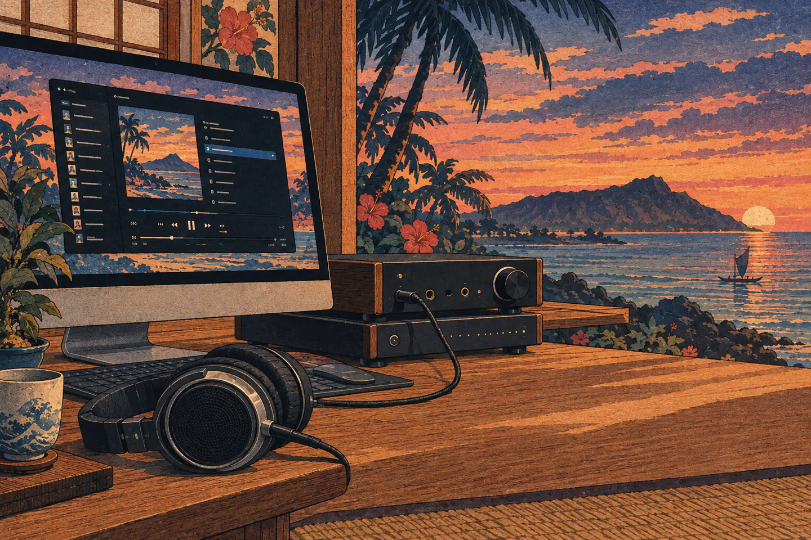

# Kahawai Server and Player

Kahawai lets you listen to your own music collection, the files on your computer's drives
or on a network drive, anywhere in your home, with the care of a good hi-fi system. There
are no accounts, subscriptions or cloud services: it runs on your own computer and your
own home network, and your music never leaves it. It comes in two parts: **Kahawai
Server**, which looks after your library, and **Kahawai Player**, the app you listen with.

## Kahawai Server

Kahawai Server catalogs the music on your drives and network shares and serves it to the
players in your home. It reads your files but never changes them, and once it's set up it
runs quietly in the background.

- **Guided setup:** pick your music folders and the server scans them; a status window
  shows each scan as it runs, when it ran and how long it took.
- **Big libraries, fast:** a first scan of a large network drive reads tags first and
  fingerprints files afterwards in the background; rescans pick up only what changed.
- **Almost any format:** FLAC, ALAC, AAC, MP3, Ogg Vorbis, Opus, WAV, AIFF, and DSD (DSF
  and DFF). MQA files are detected.
- **Streams what each player needs:** the original file, or converted on the fly; DSD as
  DoP for DACs that take it; tracks back to back without gaps.
- **Tidy genres:** messy genre tags are mapped to a clean set for browsing and search,
  without touching your files.
- **Album info, if you want it:** looks up missing years and covers at MusicBrainz and the
  Cover Art Archive. Off until you turn it on.
- **Playlists,** including importing M3U files.

## Kahawai Player

Kahawai Player is the Mac app you listen with: browse your library, build a queue, and
play it with sound quality taken seriously.

- **Browse your way:** albums, artists, genres and playlists as a grid or a list, sorted
  by artist, title or year, with fast search.
- **Opens instantly:** the player keeps a copy of your library, so only changes come over
  the network, and you can still browse when the server is off. It reopens where you
  left off.
- **A queue that remembers:** gapless playback with shuffle and repeat, kept across
  restarts along with the position you were at.
- **Straight to your DAC:** bit-perfect output (macOS), and native DSD over DoP, so MQA and
  DSD reach the DAC untouched.
- **Sound shaping when you want it:** an 8-band parametric equalizer, loudness
  normalization, headphone crossfeed, a limiter, and an optional analog warmth stage with
  an A/B blind test.
- **Right-click anything:** play a track or album, jump to its artist or album, add it to
  the queue or a playlist without duplicates, or see its full details.

## Important!

> **⚠️ Trusted-LAN only.** This server has **no authentication, no TLS, and no rate limiting**. Bind it to a private LAN interface (`bind = "192.168.x.x:..."`) behind your router's firewall. **Never expose it to the internet.** Auth/TLS are v2 scope (`docs/Roadmap.md`).

## Quick start

Everything is a script in `scripts/`. From the repository root:

```bash
scripts/setup.sh              # guided setup: your music folder, network address, audio options
scripts/start-server.sh -d    # start the server in the background (builds it the first time)
scripts/start-client.sh       # wait for the server, then open the player
```

That's it. **Installing the beta from the disk image instead?** See
[docs/Installation.md](docs/Installation.md): installation, troubleshooting and FAQ.

Day to day:

| Script | What it does |
|---|---|
| `scripts/setup.sh` | Wizard for the server (`config.toml`) and the player's settings. Safe to re-run; it backs up what it replaces. `setup.sh server` or `setup.sh client` does just one half. |
| `scripts/start-server.sh` | Runs the server (`-d` = in the background, with a log and pid file). Also `--status`, `--stop`, `-c other.toml`, and `--build` to rebuild first. It runs the newest of the native and universal builds. |
| `scripts/start-client.sh` | Opens the player once the server answers. `--url http://host:8080` points it at another server; `--dev` runs the development build instead. |
| `scripts/build-server-universal.sh` | Universal (Intel + Apple Silicon) server binary → `dist/kahawai-server`. |
| `scripts/build-client-universal.sh` | Universal player → `dist/Kahawai Player.app` and `.dmg`. |
| `scripts/build-combined-dmg.sh` | Both Mac apps, universal, in one disk image → `dist/Kahawai.dmg` (Kahawai Player, Kahawai Server and an Applications shortcut), for running both on the same Mac. Also leaves each app's own `.app` and `.dmg` in `dist/`. Unsigned; see the script for signing. |
| `scripts/start-dev-combined.sh` | Development: runs the Server app and the Player together in Tauri dev mode (both UIs hot-reload, debug Rust builds); the Player starts once the server answers. Ctrl+C stops both. macOS only. |

A universal build is one command but two compiles (one per architecture, merged into a single binary); the frontend is built once.

## Status

v1 is code-complete: server (147 tests at last server gate) + macOS client (C1–C3, 207 tests workspace-wide at last gate), clippy-clean, zero warnings. What remains is Mac-gated: first `cargo tauri build`, CoreAudio runtime validation on a real DAC, universal bundle, signing/notarization — checklist in `player/README.md`.

## Documentation map

Docs live under `docs/`, split by audience and by how settled the material is:

- **`docs/v1/`** — design & feature docs for what's actually built and shipped. Read these before touching code.
- **`docs/v2/`** — upcoming specs; nothing in here has been started yet (see `docs/Backlog.md` for how these map to tracked work).
- **`docs/users/`** — non-technical, general-audience material (press release, background articles). No code references, nothing here assumes you're a contributor.
- **`docs/Backlog.md`** / **`docs/Roadmap.md`** — cross-cutting planning docs, not tied to a single version.

New here? Read top to bottom. Already know the codebase? Jump to whichever group you need.

**Start here**

- `docs/users/kahawai-press-release.md` — the pitch: what Kahawai is and why it exists, written for someone seeing the project for the first time.

**Design & architecture** (`docs/v1/`) — the durable "why it's shaped this way" docs, read before touching code

- `docs/v1/DESIGN.md` — formal design specification: philosophy, architecture of both applications, long-term considerations. The one doc to read if you only read one.
- `docs/v1/kahawai-server-spec.md` — server build record: stories S1–S13, API, DSD work, deployment (written as the work happened; historical record, not a living spec).
- `docs/v1/kahawai-player-design.md` — client build record: engine, stores, UI, DSP. Companion to the server spec above.
- `docs/v1/kahawai-server-desktop-ui-spec.md` — macOS desktop UI spec for the first-run setup wizard. Decisions here are ratified — don't relitigate without asking.

**Feature deep-dives** (`docs/v1/`) — how a specific piece of playback actually works

- `docs/v1/Audiophile-Mode.md` — what the Settings screen's "Best quality" means: bit-perfect playback, native DSD, and the fallback decision tree.
- `docs/v1/EQ.md` — how the player's EQ works today, what it doesn't do, and how Audio Units could extend it later.
- `docs/v1/kahawai-fast-first-scan-spec.md` — how the server catalogs a large network share quickly: a metadata-only scan first, content hashing afterwards as a resumable background job. Includes the benchmark measurements.
- `docs/v1/kahawai-crossfeed-dsp-spec.md` — headphone crossfeed: the bs2b algorithm, the presets, and where it sits in the chain.
- `docs/v1/Analog-Emulation.md` — research and design for adding tube/transistor analog character to the playback chain (branch: `analog-poc`). Built and tested; see `docs/Backlog.md` for the listening-review follow-up.
- `docs/users/Euphonics-Vacuum-Tube-Primer.md` — background primer on why tube gear sounds the way it does; companion reading for Analog Emulation, written for a general audience.
- `docs/v1/SACD-Extraction.md` — a scope decision, not a roadmap item: why SACD ISO decoding is permanently out of scope.

**Upcoming work** (`docs/v2/`) — specs for features not yet started; also tracked in `docs/Backlog.md`

- `docs/v2/kahawai-genre-normalization-spec.md` — genre normalization + browse/search.
- `docs/v2/kahawai-metadata-enrichment-spec.md` — metadata remapping & external enrichment (Phase C).
- `docs/v2/kahawai-player-catalog-cache-spec.md` — local catalog cache so the player doesn't re-pull everything on restart.

**Planning & scope**

- `docs/Roadmap.md` — future enhancements: possibilities, not commitments, grouped by area.
- `docs/Backlog.md` — deferred decisions and known rough edges, with enough context to pick them back up cold; includes the `docs/v2/` specs above.

Outside `docs/`: `player/README.md` (the desktop client's own setup/build README), `LICENSE`, `DISCLAIMER.md` (the disclaimers, shown in both apps' About and in this README), `CLAUDE.md` (orientation for AI coding agents working in this repo), and `player/ui/src/content/notices.md` (third-party dependency licenses).

## Workspace

| Crate / dir | What |
|---|---|
| `crates/kahawai-core` (`kahawai-core`) | Shared types: API models, `AudioFormat` + transcode ladder, `dsd_story` resolution, TOML config, errors. No I/O deps — compiles anywhere. |
| `crates/kahawai-server` (`kahawai-server`) | Axum binary: scanner, SQLite catalog, browse API, `/stream/:id`, playlists, persistent jobs, hardening. |
| `crates/kahawai-player-core` | Platform-independent playback engine: state machine, queue/shuffle/repeat, HTTP transport, symphonia decode, DSP (EQ + loudness), `AudioSink` trait. **Zero Tauri, zero platform imports** — the crate the future iOS/Android shells will reuse. |
| `crates/kahawai-player-api` | Async `reqwest` client covering every server endpoint; reuses `kahawai-core` API types. |
| `crates/kahawai-player-audio` | Real OS audio sinks: `CpalSink` (shared-mode PCM, all OSes) and `CoreAudioDopSink` (macOS-only exclusive hog-mode DoP). |
| `player/` | Tauri 2 desktop client: `src-tauri/` (thin shell, excluded from the Cargo workspace — see below) + `ui/` (Vue 3 + Vite + Pinia + strict TypeScript). |
| `scripts/` | `setup.sh` · `start-server.sh` · `start-client.sh` · `start-dev-combined.sh` · `build-server-universal.sh` · `build-client-universal.sh` · `build-combined-dmg.sh` |

`player/src-tauri` is deliberately **excluded** from the Cargo workspace: it needs system WebKit/GTK dev libraries absent from some build machines. It path-depends on the four workspace crates, so all logic stays shared — only the thin shell builds separately, on the Mac.

## Development

`cargo test --workspace` for the Rust crates and `npm test` in `player/ui` for the client. The tests use temp dirs and a temp SQLite database: nothing touches your network or your real files.

## API (v1)

| Method & path | Notes |
|---|---|
| `GET /api/health` | `{"status":"ok","version":"…"}` |
| `GET /api/albums` · `GET /api/albums/:id` | paginated; detail carries ordered `track_ids` |
| `GET /api/artists` · `GET /api/artists/:id` | |
| `GET /api/tracks/:id` | |
| `GET /api/search?q=` | FTS5 over title/album/artist |
| `GET /api/artwork/:hash` | ETag/`304` aware; hash must be hex |
| `GET/POST /api/playlists` | `POST` accepts `track_ids` or `from_queue` + `queue_track_ids` |
| `PUT /api/playlists/:id/tracks` | `{track_ids, album_ids, mode: append\|replace}`; albums expand in disc/track order |
| `PATCH /api/playlists/:id` | rename |
| `DELETE /api/playlists/:id` | |
| `POST /api/playlists/import` | m3u/m3u8 (path or multipart upload); reports matched + unmatched entries |
| `GET /api/jobs` · `POST /api/jobs` · `GET /api/jobs/:id` | persistent jobs (scan, ISO extract) |
| `POST /api/scan` | `202` starts a scan job; `409` if one is already running |
| `GET /stream/:id` · `HEAD /stream/:id` | Range streaming + `?format=` `?seek_ms=` `?next=` (below) |

### Streaming

- `GET /stream/:id` → `200` full file, or `206 Partial Content` with `Content-Range` for `Range` headers. Unsatisfiable ranges → `416`. Suffix (`bytes=-N`) and open-ended (`bytes=N-`) ranges work; multi-range is rejected. Constant memory: bytes flow file → socket in bounded chunks.
- `?format=flac|opus|mp3` transcodes on the fly (`X-Transcode-Chain` header names the chain, e.g. `dsf64->flac`). Disabled encoders answer `501` naming the required cargo feature (`encode-opus`, `encode-mp3`).
- `?format=dop` serves native DSD-over-PCM in a WAV container (DSD64→176.4 kHz, DSD128→352.8 kHz, DSD256→705.6 kHz; `0x05`/`0xFA` markers). Non-DSD + `?format=dop` → `400`.
- `?seek_ms=` seeks transcodes sample-exactly (DSD seeks use phase-aligned FIR warm-up). A *seeked* DoP response carries the raw payload suffix with no WAV header — test-pinned server behavior the client handles explicitly.
- `?next={id}` chains the next track gaplessly: one encoder session when the PCM specs match (sample-exact, no boundary dip), chained streams otherwise. `X-Gapless-Next` / `X-Gapless-Mode` describe what the server did.
- `HEAD` returns the same metadata (length, ranges, transcode chain) without the body.

## Why these libraries

Every dependency below was chosen for a specific problem. The bias throughout: pure-Rust where a good crate exists (no system headers, no `sudo`, builds on a bare VM), bundled C sources behind default-off cargo features where no Rust option exists, and in-house code only where no crate does the job.

| Crate | Problem it solves | Why this one |
|---|---|---|
| `axum` | HTTP server: REST API + streaming endpoints | Tower-ecosystem interop (`tower-http` gives CORS, body limits, timeouts, tracing for free), Tokio-native, ergonomic extractors. Chosen over actix-web/rocket/warp for the middleware story. |
| `tokio` | Async runtime | Concurrent streams, background job tasks, graceful shutdown. The workload is genuinely async I/O, so Tokio earns its place. |
| `sqlx` (sqlite, `runtime-tokio`, no default features) | Async catalog persistence, migrations, WAL | Async-first (unlike `rusqlite`, which would block the runtime); connection pooling; migrations as SQL files. Default features off to keep the build lean. |
| `blake3` | File identity: dedupe, change detection, artwork hashing | Multithreaded-fast with a streaming API — hash-while-you-read during scans, so identity costs ~nothing extra. |
| `lofty` | Tags + technical properties across formats | One API for FLAC/MP3/MP4/Vorbis/Opus/… instead of per-format parsing code. |
| `symphonia` | Decode every PCM source format into the transcode pipeline | Pure Rust, no system deps, broad format coverage. |
| `symphonia-adapter-libopus` | Decode Opus *sources* | Plugs libopus decoding into the symphonia pipeline; the adapter already bundles libopus, so no feature flag needed. |
| `flacenc` | FLAC *encoding* for transcodes | Pure-Rust FLAC encoder — no C toolchain required for the default build. |
| `opusic-sys` / `mp3lame-sys` (optional, default-off) | Opus/MP3 *encoding* | No mature pure-Rust encoders exist; both bundle their C sources so builds need no system headers and no `sudo`. Disabled encoders fail with an honest `501` naming the feature. |
| `walkdir` | Recursive library traversal in the scanner | Correct symlink/loop handling without hand-rolled recursion. |
| `tower` / `tower-http` | Hardening middleware | CORS for the Tauri webview, 10 MiB body caps (`413`), 60 s API timeouts (`408`), request tracing — S10 without hand-rolled middleware. |
| `tracing` / `tracing-subscriber` | Structured logging | Per-stream debug context, the trusted-LAN startup banner, `RUST_LOG` filtering. |
| `serde` / `serde_json` / `toml` | JSON wire format, TOML config | The obvious choices; `toml` keeps `config.toml` human-editable. |
| `thiserror` / `anyhow` | Error handling | `thiserror` for typed library errors (`MusicError` crosses crate boundaries); `anyhow` for application-level context at the edges. |
| `bytes`, `tokio-util`, `tokio-stream` | Streaming-body plumbing | Bounded backpressure channels bridged into HTTP response bodies — this is what keeps a 200 MB DSF stream at constant memory. |

**Deliberately in-house** (no crate did the job): DSF/DFF parsers (verified against the Sony specs — DSF is LSB-first, DFF is MSB-first), the DoP packer, the Kaiser-windowed-sinc FIR decimator with sample-exact seek, the RBJ-biquad parametric EQ, and the R128-style loudness measurement. Each is covered by bit-exact or property tests rather than by trusting an external implementation.

## macOS universal binary (server)

```bash
./scripts/build-server-universal.sh
```

**Mac-only** — builds `aarch64-apple-darwin` + `x86_64-apple-darwin` and combines them with `lipo`. `cargo check` on Linux validates the code; producing the binary needs macOS with both Rust targets installed.

## Tests

`cargo test --workspace` (207 at the last gate; hermetic — temp dirs, temp SQLite, no network):

- `kahawai-core`: extension → `AudioFormat` mapping, streamable set, transcode-ladder decisions, `dsd_story` resolution, TOML config round-trip, API-model JSON round-trips.
- server: Range parsing (`200`/`206`/`416`/suffix/open-ended), scanner (incremental rescan, missing-flag, artwork dedup, FTS5, artist splitting), DSF/DFF bit-exact decode incl. non-symmetric patterns, FIR decimator properties, sample-exact DSD seek, transcode chains (`X-Transcode-Chain`, Opus granule pre-skip), DoP packing (markers, WAV header, bit-exact seeks), gapless `?next=` (single-session sample counts, chained mode, 404), m3u import (matched/unmatched), playlist album expansion + append/replace, job persistence + restart recovery, traversal/symlink rejection, body-limit and timeout behavior.
- `kahawai-player-core`: queue model, playback engine through a recording `VecSink` (sample-exact gapless, both seek paths, format resolution, clean DoP rejection), DSP (biquad transparency/boost, loudness math), DoP client parsing incl. headerless seek continuation.
- `kahawai-player-api` / `kahawai-player-audio`: contract and sink unit tests.
- `--features encode-opus` / `--features encode-mp3` suites also green.

Gates for every phase: `cargo check` zero warnings, full suite green, `cargo clippy --workspace --all-targets -- -D warnings` clean, `cargo fmt`.

## v1 scope notes

- LAN-only: no auth, no TLS — v2 (`Roadmap.md`).
- AAC confirmed; no DRM/protected content.
- DoP gapless is best-effort (chained WAVs) by design; the DoP client sink is macOS-only and Mac-gated for first validation.
- Loudness pre-scan doubles first-play LAN bandwidth (documented in `player/README.md`); gain cache is in-memory.

## Disclaimers

- **No warranty.** Kahawai is provided "as is", without warranty of any kind, express or
  implied, including the implied warranties of merchantability and fitness for a
  particular purpose. To the extent permitted by law, the authors are not liable for any
  claim, damages or other liability arising from its use (see sections 15 and 16 of the
  GNU Affero General Public License).
- **Your hearing and your equipment.** Set the volume with care, especially with
  headphones. Sound shaping (equalizer, loudness, analog warmth) can raise the level, and
  sending DSD (DoP) or bit-perfect audio to a device that doesn't support it can produce
  loud noise. Start low. The authors are not responsible for damage to hearing or
  equipment.
- **Your music.** Kahawai plays the files you give it. You are responsible for having the
  right to the music in your library; Kahawai does not share or distribute it beyond your
  own network.
- **Security.** The server has no authentication and no encryption. It is meant for a
  private home network you trust; do not expose it to the internet.
- **Third-party services.** Album info lookup, off unless you turn it on, uses MusicBrainz
  and the Cover Art Archive under their own terms. Their data and images belong to their
  owners, and their availability and accuracy are not guaranteed.
- **Trademarks.** Product and company names mentioned, among them MQA, MusicBrainz, Apple,
  macOS and Core Audio, are trademarks of their respective owners. Kahawai is an
  independent project and is not affiliated with or endorsed by them.

## License

Copyright (c) 2026 Kyo Suayan.

Kahawai is free software, licensed under the GNU Affero General Public License v3.0 or later (AGPL-3.0-or-later): you can redistribute it and/or modify it under those terms. It comes with **no warranty**. See `LICENSE` for the full text.

Because the server is used over a network, the AGPL gives everyone who uses a Kahawai server that way the right to its source code too: each server names where the source is (`source_url` in `GET /api/identity`), and both apps' About dialogs show the license and where to get the source.

Third-party dependency licenses are listed in each app's open-source notices: `player/ui/src/content/notices.md` (Player) and `crates/kahawai-server/ui/src/content/notices.md` (Server), generated by `scripts/gen-notices.py`.
