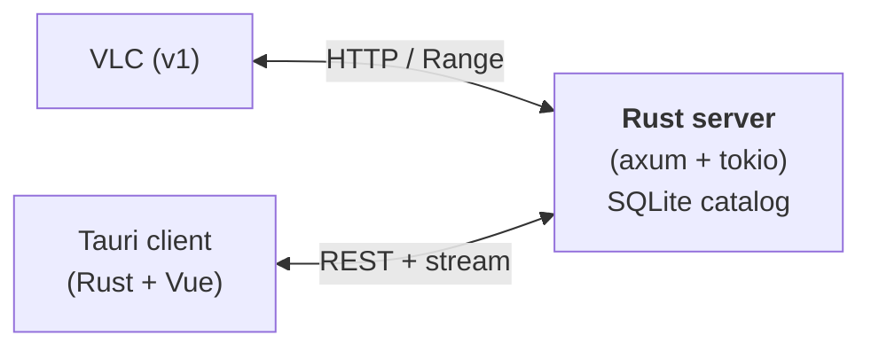

# Kahawai Server — Design Spec (v1)

*2026-09-25. New project. ~1 TB collection: MP3, MP4/M4A, AAC, FLAC, Opus, OGG Vorbis, DSD (DSF/DFF). No DRM or protected-content support in v1 (Kyo, 2026-09-25). Initial deployment is LAN over Wi-Fi; auth/TLS deferred to v2.*

## 0. Goals and non-goals

**Goals:** a self-hosted Rust server that catalogs the collection, browses by album/artist/playlist, and streams with real-time decode/transcode where the client can't handle the source format. VLC works as the v1 client. A Tauri + Rust client follows.

**Non-goals for v1:** video, multi-user households with per-user libraries, internet-scale concurrency, DSP/plugin hosting on the client (v2 spike).

## 1. Architecture

One binary, one SQLite DB, one config file. This is a genuine async-I/O workload — tokio is the right runtime here (unlike Koa, where it was rejected).

## 2. Format strategy

| Source | Decode | Stream to VLC/client |
|---|---|---|
| MP3, FLAC, M4A/MP4 (AAC/ALAC), WAV, AIFF, OGG Vorbis | **symphonia** (pure Rust, SIMD, ±15% of FFmpeg) | Bit-perfect passthrough — serve the file bytes, no transcode |
| Opus (.opus) | **symphonia + `symphonia-adapter-libopus`** (third-party adapter over libopus) | Bit-perfect passthrough |
| DSF / DFF (DSD64/128) | Own parser + FIR decimation filter DSD→PCM (this is the established approach; symphonia does **not** do DSD) | **Story A — DSD as PCM:** real-time transcode → FLAC 24/88.2 (or 176.4). **Story B — native DSD:** bit-perfect DSD stream to a DSD-capable DAC (DoP encapsulation); separate client audio path, separate feature |

SACD ISO is cataloged but never decoded — see `SACD-Extraction.md`.

**Transcode ladder** (only when passthrough isn't possible or bandwidth demands it): source → PCM (symphonia or DSD decimator) → **rubato** resample → FLAC (lossless, default) / Opus (bandwidth-constrained remote) / MP3 (legacy clients). Never transcode lossy→lossy unless the client explicitly requests a lower bitrate.

## 3. Server components

### 3.1 Scanner
- One walk over the configured music dirs feeds a bounded pool of 16 blocking workers; a single writer commits their results 500 tracks per SQLite transaction. There is no counting pre-walk: over a network share it costs as much as the scan itself.
- Metadata via **lofty** (tags, technical properties, embedded artwork) → SQLite. The file size and mtime come from the walk's own stat.
- **No content hashing during the scan.** `tracks.hash` is NULL ("hash pending") for rows the scan writes; `tracks.hash_algo` names the algorithm of any hash that is present (rows hashed by earlier versions are `blake3-v1`). Hashing a whole library over SMB takes hours and gives nothing on a first scan.
- **Content hashing is a separate background job** (`hash_files`, docs/v1/kahawai-fast-first-scan-spec.md Phase B). Every completed scan queues it; it can also be started with `POST /api/jobs` (`kind: "hash_files"`), one at a time, and it never blocks a rescan. It hashes pending rows with 4 workers and 1 MiB reads, writing each hash (with `hash_algo`) as soon as it is computed: the NULL marker is the checkpoint, so a killed run resumes with no rehashing. With `scan_on_startup` off, startup resumes it directly. A file whose size/mtime changed since the scan is left pending for the next scan to re-read. Until a row is hashed, change detection is size + mtime only.
- Incremental: an unchanged (path, size, mtime) is skipped; a changed file's row is re-read in place (its hash reset to pending); missing files are marked, not deleted (relink-friendly).
- Runs as a background job. Progress is estimated from the previous scan's track count (a first scan has no estimate). Unreadable directory entries are logged and counted (`scan_log.walk_errors`, and in the job's result message). Every 5 s the scan logs its throughput: files/sec, average per-file analysis time, DB commits/sec.

### 3.2 Catalog (SQLite)
Tables: `tracks` (id, path, hash (nullable: pending), hash_algo, format, sample_rate, bit_depth, channels, duration_ms, bitrate), `albums`, `artists`, `album_artists`, `track_artists` (multi-artist), `artwork` (hash → blob, deduped), `playlists`, `playlist_tracks` (positioned), `scan_log`. FTS5 virtual table for search across title/album/artist.

### 3.3 Browse API (REST, JSON)
- `GET /api/albums`, `/api/albums/{id}`, `/api/artists`, `/api/artists/{id}`
- `GET /api/tracks/{id}` (full metadata), `GET /api/search?q=`
- `GET /api/playlists`, `POST /api/playlists`, `PUT /api/playlists/{id}/tracks` (ordered), `DELETE`
- `GET /api/artwork/{hash}` (with ETag / If-None-Match caching)
- `POST /api/playlists/import` — m3u/m3u8 file import, path remapping on ingest.
- Queue↔playlist interplay (§3.8): add whole albums or individual tracks to the queue or straight into a named playlist; save the current queue as a playlist.

**v2 option, noted:** implement the **Subsonic API** dialect for the browse endpoints. It's a de-facto standard — one compatibility shim buys DSub, play:Sub, and a dozen other clients for free. Not v1 scope.

### 3.4 Streaming endpoints
- `GET /stream/{track_id}` — full **HTTP Range** support (`Accept-Ranges`, 206 Partial Content). This is what makes VLC seekable; non-negotiable.
- `GET /stream/{track_id}?format=flac|opus|mp3` — transcoded variants.
- Bit-perfect default: if the client takes the source format (VLC handles FLAC/MP3/M4A/AAC natively), serve bytes, touch nothing.
- Transcode sessions: decode → resample → encode as a **streaming pipeline** with backpressure; never buffer a whole track in memory. One blocking-thread pool for decode/encode (CPU-bound), tokio for the socket (I/O-bound).
- `HEAD` support for duration probing; `Content-Duration` where known.

**Scrubbing (timeline seek).**
- Passthrough streams: scrub is HTTP Range — the client maps the seek-bar position to a byte range. Nothing server-side beyond §3.4's Range support.
- Transcoded streams: the client seeks with `?seek_ms={n}`; the server **restarts the transcode pipeline at the target sample offset** (decode from the nearest seek point, resample/encode from there). Seeks are not sample-exact on lossy transcodes — document the granularity (± one encoder frame) and never claim otherwise.
- The client seek bar shows buffered ranges (from its own download progress); seeking into unbuffered regions re-requests with the appropriate Range or `seek_ms`.

**Format options.**
- Every stream URL takes `?format=`: `passthrough` (default when the client handles the source), `flac`, `opus`, `mp3`.
- Per-client **preferred format ladder** in server config (e.g. desktop: passthrough → flac; mobile-later: opus): the server picks the first ladder entry the source can satisfy. DSD sources resolve per the story selector — Story A (PCM/FLAC) or Story B (native DoP) — chosen per output device.
- Per-playback override: the client's format picker can override the ladder for one session (`?format=` wins over the ladder). The Now Playing badge always shows the actual chain (e.g. "DSF64 → FLAC 24/88.2").

### 3.5 Gapless playback
- Server pre-decodes the head of the next queued track when the client requests `?next={id}` (his own client will do this; VLC manages its own queue).
- Transcoded streams: compensate encoder delay/padding (Opus pre-skip; FLAC chained properly is inherently gapless). Document the sample offsets.

### 3.6 Config and ops (v1: LAN only)
- v1 assumes a trusted LAN (Wi-Fi). **No auth, no TLS in v1** — bearer tokens and TLS move to v2 (§6). Document the LAN-only assumption in the README.
- TOML config: music dirs, bind address, transcode defaults.
- Structured logs with per-stream metrics (track, format, transcode chain, bytes served, duration). No analytics, no phone-home.

### 3.7 Long-running task queue + user notifications
ISO extraction (and later, bulk transcodes) run for minutes. The user must never stare at a hung UI:

- Server-side **job queue**: `POST /api/jobs` enqueues (e.g. `extract_iso`, `transcode`), each job has id, type, progress as a 0.0–1.0 float, status (queued/running/done/failed), result payload. Wire enums are `snake_case` (`"extract_iso"`, `"ogg_vorbis"`).
- `GET /api/jobs` lists; `GET /api/jobs/{id}` polls status. (SSE push is a v2 refinement; polling at 1 Hz is fine for v1.)
- Client surfaces a **toast** when a job starts ("Scanning…"), updates progress inline, and toasts again on completion or failure with the outcome (tracks added, error message).
- Jobs survive client disconnects (server-owned); a reconnecting client picks up in-flight job states from `GET /api/jobs`.

### 3.8 Queued playlists (queue ↔ playlist interplay)

The play queue is client-side (kahawai-player-core), but it round-trips through the server API so queues become playlists and playlists become queues:

- **Add to queue:** single track, whole album (track order), or all tracks of an artist — appended or "play next". Queue ops are client-local and instant.
- **Add to playlist:** the same pickers (track / album / artist) can target a named playlist instead; `PUT /api/playlists/{id}/tracks` accepts track ID lists and album IDs (server expands albums in track order).
- **Save queue as playlist:** `POST /api/playlists` with `from_queue=true` — client sends the ordered track IDs, server creates the positioned playlist.
- Queue itself is persisted client-side (PL2) and is not a server object in v1 — the server only learns about queues when they're saved as playlists.

## 4. Performance design

- **tokio** for connections; CPU-bound decode/encode on `spawn_blocking` pool sized to cores (this is the correct tokio/blocking split).
- Stream with `axum::body::Body::from_stream` — constant memory per stream regardless of file size; a 1 TB library and a 200 MB DSF both stream in a few MB of RAM.
- Connection cap + per-IP stream limit (defense against accidental self-DoS from a misbehaving client).
- SQLite: WAL mode, read pool for browse queries, single writer for scanner.
- Target numbers (set after baseline, not before): concurrent transcode sessions before CPU saturation on the host; stream start latency < 300 ms for passthrough, < 1.5 s for DSD→FLAC (decimator warmup).

## 5. Tauri client (v2 of the project, spec'd now)

- **Rust backend:** thin — HTTP client to the server API, audio output via **cpal** (cross-platform) or **rodio**; gapless via pre-fetched next-stream buffers and sample-accurate handoff.
- **Frontend:** Vue 3 + **Pinia** (yes — Pinia is the right call; same stack vocabulary as Koa). Stores: `library` (albums/artists/search, paginated), `player` (queue, position, transport state), `playlists`.
- Tauri commands as the source of truth; the webview never talks to the server directly (keeps auth token out of the frontend).
- Artwork via the server's `/api/artwork` with local disk cache.

### 5.1 Client-side plugins — honest assessment
- **v1 client ships built-in DSP only:** parametric EQ + loudness normalization. This covers 90% of the "I want it to sound different" need with zero hosting risk.
- **VST3/AU hosting is a v2 research spike, not a v1 feature.** Verified 2026-09-25: `nih-plug` is for *writing* plugins, not hosting them — there is no mature Rust VST3 host crate. AU hosting on macOS via the Audio Unit C API is the more feasible of the two (macOS-only, well-documented API), VST3 hosting would mean writing a host against the Steinberg SDK from scratch.
- Do not design the v1 audio path around a plugin-host abstraction that doesn't exist yet. Ship the EQ; spike the hosting separately.

## 6. Must-have feature checklist (v1 server)

| Done | ID | Feature |
|------|----|---------|
| ☐ | S1 | Scanner: walk → BLAKE3 → lofty metadata → SQLite, incremental rescan |
| ☐ | S2 | Browse API: albums, artists, tracks, search (FTS5), artwork with ETags |
| ☐ | S3 | `GET /stream/{id}` with full Range support (VLC-seekable) |
| ☐ | S4 | Bit-perfect passthrough for symphonia-covered formats (incl. Opus via libopus adapter, OGG Vorbis) |
| ☐ | S5a | DSD story A: DSF/DFF parse + FIR decimation → real-time FLAC transcode |
| ☐ | S5b | DSD story B: native DSD passthrough (DoP) to DSD-capable DAC — separate client audio path |
| ☐ | S6 | Transcode ladder: FLAC default, Opus/MP3 on `?format=` request |
| ☐ | S7 | Playlists: CRUD, ordering, m3u/m3u8 import |
| ☐ | S11 | Queued playlists: add track/album to queue or playlist; save queue as playlist (§3.8) |
| ☐ | S12 | Scrubbing: Range seek on passthrough; `?seek_ms=` transcode restart; buffered-range display |
| ☐ | S13 | Format options: `?format=` ladder, per-client preferred ladder, per-session override, DSD story selector |
| ☐ | S8 | Gapless: `?next=` pre-decode hint, encoder padding compensation |
| ☐ | S9 | Job queue API + client toasts for long-running tasks (scan progress/completion) |
| ☐ | S10 | Backpressure streaming (constant memory), connection caps, WAL SQLite; TOML config, structured per-stream logging (LAN-only: no auth/TLS in v1) |
| ☐ | C1 | Tauri client: browse + queue + gapless playback (cpal/rodio) |
| ☐ | C2 | Pinia stores (library / player / playlists), artwork disk cache |
| ☐ | C3 | Built-in parametric EQ + loudness normalization |

**Explicitly v2:** Subsonic API dialect, multi-user, **auth/TLS**, VST3/AU plugin hosting, smart playlists, SSE job push.

## 7. Phasing

1. **S1+S2** — catalog first; browse the 1 TB in a client before streaming a byte.
2. **S3+S4+S12** (passthrough half) — bit-perfect streaming; VLC plays FLAC/MP3/M4A/AAC/Opus/OGG on day one, seekable via Range.
3. **S5a+S6+S12** (transcode half) **+S13** — DSD decimator, transcode ladder, `?seek_ms=` scrub on transcodes, format ladder + per-session override.
4. **S5b** — native DSD/DoP passthrough (separate story, separate client audio path).
5. **S7+S11+S8+S9+S10** — playlists, queue↔playlist interplay, gapless, job queue + toasts, hardening (LAN-only, no auth).
6. **C1–C3** — Tauri client: queue UI with save-as-playlist, seek bar with buffered ranges, format picker + Now Playing chain badge.
7. **Spikes (parallel):** AU plugin-host prototype.

## 8. Decisions (resolved 2026-09-25, Kyo)

1. "aacs" = plain AAC. No DRM or protected-content support in v1.
2. Native DSD (DoP to a DSD-capable DAC) and DSD→PCM→FLAC are two separate features (S5b vs S5a), not one.
3. v1 is LAN over Wi-Fi, no auth/TLS. Secure/authenticated connections are v2.
