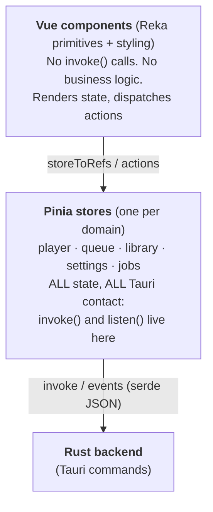

# Tauri + Reka UI + Pinia — Best Practices

A field guide for building desktop apps with **Tauri 2** (native shell), **Vue 3 + Reka UI** (headless component primitives), and **Pinia** (state management). Distilled from shipping a real app on this stack — most of these are written down because they hurt once.

**The one rule:** Pinia owns all state and all backend contact. Reka owns interaction primitives and nothing else. Tauri is a transport you call deliberately, not constantly. When those boundaries hold, the stack is genuinely pleasant.

---

## 1. Architecture: where things live



Components are thin. Stores are the application's API. The backend is a service the stores talk to.

---

## 2. Pinia practices

### 2.1 One store per domain, setup-style

Organize by domain, not by page: `usePlayerStore`, `useQueueStore`, `useLibraryStore`, `useSettingsStore`, `useJobsStore`, `useToastStore`. Prefer setup-style stores (`defineStore('player', () => { ... })`) — type inference for state, getters, and actions is significantly better than the options API.

### 2.2 Every Tauri `invoke` lives in a store action

```ts
// ✅ in the store
async function loadAlbums() {
  status.value = 'loading'
  try { albums.value = await invoke<Album[]>('list_albums') }
  catch (e) { error.value = toError(e) }
  finally { status.value = 'idle' }
}

// ❌ never in a component
const albums = await invoke('list_albums') // no — where's the error state?
```

When the backend contract changes, there is exactly one place to fix.

### 2.3 Async actions own their status

Expose `status: 'idle' | 'loading' | 'error'` (and an `error` field) on the store, set in `try/finally`. Components render state; they don't juggle promise lifecycles or duplicate loading spinners.

### 2.4 Wire Tauri events once, at startup

Backend-pushed updates (`listen('job-progress', …)`, playback events) belong in a store `init()` called once from app startup — not in components. Component-level subscriptions produce duplicate listeners and leaks on remount. The `unlisten` function belongs to the store's lifecycle.

```ts
// main.ts or App.vue setup, once
const jobs = useJobsStore()
jobs.init() // subscribes to backend events; stores the unlisten fn
```

### 2.5 Type the Rust↔TS boundary explicitly

Tauri serializes through serde JSON. Rust enums (tagged/untagged), `Option` vs `null`, newtypes, and `u64` precision all have opinions about what arrives in JS. Keep strict TypeScript interfaces mirroring the Rust types, and normalize payloads at the store boundary — never in templates.

### 2.6 Keep cross-store dependencies one-way

Stores calling other stores' actions is fine, but keep the direction acyclic (`queue → player`, never `player → queue → player`). Circular store imports are a startup-order bug waiting to happen. When two domains genuinely need each other, have both react to a third store's state.

### 2.7 Read state with `storeToRefs`

Destructuring a store loses reactivity. `const { albums } = storeToRefs(useLibraryStore())` keeps it. Actions can be destructured directly.

---

## 3. Reka UI practices

### 3.1 Headless means you own the CSS

Reka ships behavior, zero styles. Every Dialog, DropdownMenu, Toast, and Select needs your overlay/content CSS — including open/close animations, which you drive off Reka's `data-state` attributes:

```css
.dialog-content[data-state="open"]  { animation: dialog-in 150ms ease-out; }
.dialog-content[data-state="closed"] { animation: dialog-out 120ms ease-in; }
```

Budget real time for this. It is not a drop-in component library; the payoff is total visual control with correct accessibility semantics underneath.

### 3.2 Controlled vs. uncontrolled — pick one

Most Reka components accept both `v-model:open` (controlled) and `default-open` (uncontrolled). **Never mix them on one instance.** A component that ignores your state is almost always a component receiving both.

### 3.3 Everything portals by default

Dialogs, menus, and toasts render in a portal at the body level. Your z-index discipline and stacking-context assumptions must account for content that isn't where the DOM says it is. (This is fine inside a Tauri webview — just be deliberate.)

### 3.4 Dialogs trap focus

Modal dialogs trap keyboard focus — correct for accessibility, surprising the first time. If you genuinely want background interaction, reach for the non-modal variant rather than fighting the trap.

### 3.5 `as-child` merges events — test it

`as-child` lets your own element inherit the primitive's behavior (e.g. a custom dropdown trigger). Event merging can swallow your handlers; click every `as-child` trigger explicitly in testing.

### 3.6 Toasts need their provider and viewport

Reka's Toast is a small system: `ToastProvider` + `ToastViewport` + individual `ToastRoot`s. Drive it from your existing toast store (add / dismiss actions) rather than scattering toast state through components.

### 3.7 Reka v2 is young — read the source

When docs and behavior disagree, `node_modules/reka-ui` is the documentation. Props, emits, and data attributes are all inspectable in minutes.

---

## 4. Tauri integration gotchas

### 4.1 Guard global keyboard shortcuts against open popups

**This one bites everyone.** If you have app-wide shortcuts (space = play/pause, arrows = seek), they must ignore keystrokes while a Reka menu, dialog, or popover is open — otherwise pressing space in a rename dialog toggles playback. Check whether the event target sits inside Reka's portal content or an open dialog before handling the key.

### 4.2 Never `invoke` in a hot path

Seek-slider drags, volume changes, EQ tweaks: debounce or commit on release. A Tauri round-trip per input event is wasteful and calls can queue behind each other. Update local/UI state immediately; sync to the backend at rest.

### 4.3 Guard for plain-browser development

Outside the Tauri webview (e.g. plain `vite dev` for fast CSS iteration), `window.__TAURI__` doesn't exist. Guard Tauri API access or the app whitescreens. A tiny `isTauri()` check plus a mock backend layer keeps both loops working.

### 4.4 Keep popups out of drag regions

Tauri's `data-tauri-drag-region` (frameless window dragging) and Reka popups don't mix — interactive popup content inside a drag region behaves badly. Keep menus and dialogs clear of draggable title-bar areas.

### 4.5 Persist state explicitly

Tauri persists nothing for you. Queue contents, settings, window preferences — write them out yourself (`localStorage` is fine for v1; the Tauri store plugin is the upgrade path). Decide what's restored on launch vs. what's intentionally fresh.

### 4.6 Payload size matters

`invoke` serializes to JSON. Returning a 10,000-track library in one call works but janks; paginate lists and stream large results. The same applies to events — don't fire a backend event per decoded audio frame.

---

## 5. Event handling

Four event systems coexist in this stack. Most event bugs are using the wrong one — or forgetting one has a lifecycle that needs cleanup.

| System | Direction | Examples |
|---|---|---|
| Vue template events | DOM → component | `@click`, `@keyup.enter` |
| Reka emits | primitive → component | `update:open`, `@select` |
| Tauri events | backend → frontend (`listen`) | `jobs:progress`, `player:state` |
| Pinia subscriptions | store → watcher | `$subscribe`, `$onAction` |

### 5.1 Basics

**Vue template events.** Keep handlers thin — call a method or store action, never inline logic. Learn the modifiers; they replace most manual `event.stopPropagation()` / `preventDefault()` calls:

```vue
<button @click.stop="select">…</button>          <!-- stop propagation -->
<form @submit.prevent="save">…</form>            <!-- prevent default -->
<input @keyup.enter.once="commit" />             <!-- key + once -->
<div @click.self="dismiss">…</div>               <!-- only the element itself -->
```

**Reka emits.** Every primitive documents its emits — `update:open` for open state, `@select` on menu items, value updates on Select/Slider. Use them; don't reach into the primitive's internals or DOM.

**Tauri events.** `listen(name, handler)` subscribes; the payload arrives as `event.payload`. The call returns an `unlisten` function — holding it is your cleanup contract:

```ts
import { listen } from '@tauri-apps/api/event'
const unlisten = await listen<JobProgress>('jobs:progress', (e) => {
  jobs.applyProgress(e.payload)
})
// later: unlisten()
```

### 5.2 Intermediate

**Singleton listeners in stores.** As §2.4 says: subscribe once in a store `init()`, never per-component. A component that mounts, subscribes, unmounts, and remounts will double-handle every event in between unless cleanup is perfect — and it never is.

**Namespace event names.** `jobs:progress`, `library:changed`, `player:state` — `domain:what-happened`. Flat names (`update`, `progress`) collide across features and make `listen` call sites unreadable.

**Type and normalize payloads.** Define a TS interface per event and validate at the store boundary, exactly like `invoke` results (§2.5). A backend that renames a payload field fails silently at runtime; the interface plus `vue-tsc` makes it loud.

**Coalesce floods.** Backend progress events can arrive far faster than the UI can (or should) render. Throttle in the store: update state at most every ~100ms, or only when the displayed value actually changes (percent ticks, not byte counts). The store is also the right place to derive "done" from the final event rather than trusting event order.

**`$subscribe` for persistence and side effects.** Watching a store to persist it (debounced `localStorage` write on settings change) or to mirror state elsewhere is cleaner than scattering watchers through components:

```ts
settings.$subscribe((_, state) => {
  schedulePersist(state) // debounced write
})
```

**`$onAction` for cross-cutting concerns.** Logging, analytics, or invalidating caches after specific actions — without touching the actions themselves.

**Drive shared Reka state from Pinia.** When a dialog has multiple triggers (toolbar button *and* keyboard shortcut *and* context menu), its open state belongs in the store, not in three local `ref`s:

```ts
// dialogs store
const renameTarget = ref<Playlist | null>(null)
const isRenameOpen = computed(() => renameTarget.value !== null)
```

The Dialog becomes controlled (`v-model:open` wired to the store), and every trigger just sets `renameTarget`.

### 5.3 Common patterns

1. **Progress reporting.** Backend emits `jobs:progress` per chunk → store coalesces to ~10fps → progress bar renders. Completion derived from the terminal event, with a timeout fallback.
2. **Invalidation broadcast.** Backend emits `library:changed` after a scan → store refetches the affected list. Components never poll.
3. **Global shortcuts.** One `window` keydown listener at app level, guarded against open Reka popups (§4.1), dispatching store actions (`player.toggle()`, `queue.next()`). Shortcut map lives in one place, shown verbatim in Settings.
4. **Dialog orchestration.** Store holds pending dialog state (`pendingDelete`, `renameTarget`); Reka `Dialog`/`AlertDialog` are controlled views over it. Destructive actions go through `AlertDialog` with the store clearing state on confirm *and* cancel.
5. **Optimistic UI with rollback.** Store applies the change locally, fires the backend command, and reverts on error — the toast on failure names what was rolled back. Only for low-stakes mutations; never for anything the backend is authoritative about.

---

## 6. Dev workflow & testing

- **Two loops, used deliberately.** Plain Vite dev server + mocked backend for UI iteration (fast); `cargo tauri dev` for integration (slow). Decide which layer a bug lives in before reaching for the slower loop.
- **Stores are the testable unit.** `createTestingPinia` + a mocked `@tauri-apps/api/core` `invoke` covers nearly all UI logic with no webview. Mock at the `invoke` boundary, not inside stores.
- **Typecheck in CI.** `vue-tsc --noEmit` catches the Rust↔TS drift that runtime testing misses — a renamed serde field fails silently at runtime but loudly in the typechecker if your interfaces are honest.
- **Test every `as-child` trigger and every dialog's focus behavior** manually at least once. These are the two things unit tests won't catch.

---

## 7. Pre-ship checklist

- [ ] Zero `invoke` calls outside store actions
- [ ] All `listen` subscriptions owned by stores, with `unlisten` wired up
- [ ] Backend event floods coalesced/throttled in stores before render
- [ ] Keyboard shortcuts ignore open Reka popups/dialogs
- [ ] No `invoke` in drag/input hot paths (debounced or commit-on-release)
- [ ] `window.__TAURI__` guarded for non-Tauri contexts
- [ ] Reka animations keyed off `data-state`, not JS timeouts
- [ ] No mixed controlled/uncontrolled Reka props
- [ ] `vue-tsc` clean, unit tests green with mocked `invoke`

---

## Glossary

| Term | What it is |
|---|---|
| **Tauri** | Framework for building desktop apps: a Rust backend plus a webview frontend. Version 2 supports mobile targets too. |
| **Webview** | The OS-provided browser engine (WebKit on macOS, WebView2 on Windows, WebKitGTK on Linux) that renders your HTML/CSS/JS UI inside the native window. |
| **Command** | A Rust function annotated `#[tauri::command]` and registered with the app; the backend API surface. |
| **invoke** | The JS function (`@tauri-apps/api/core`) that calls a Rust command by name, with JSON-serialized args, returning a promise. |
| **Event / listen / emit** | Tauri's pub/sub channel: the backend `emit`s named events, the frontend `listen`s for them. Used for backend-pushed updates (progress, state changes). `listen` returns an `unlisten` cleanup function. |
| **serde** | Rust's serialization framework. Tauri uses it to convert between Rust types and the JSON crossing the webview boundary — the source of most type-mismatch bugs. |
| **Pinia** | Vue's official state-management library. State lives in *stores*; components read state and dispatch *actions*. |
| **Store** | A Pinia unit of state: reactive state + getters + actions, created with `defineStore`. |
| **Action** | A store method that mutates state; the only place async work (like `invoke`) should happen. |
| **Getter** | A computed derivation of store state (like Vue `computed`, scoped to the store). |
| **storeToRefs** | Pinia helper that destructures a store's state/getters into refs without losing reactivity. |
| **Setup store** | `defineStore(id, () => { … })` — the Composition-API style of writing a store; best TypeScript inference. |
| **Reka UI** | Headless, unstyled Vue component primitives (dialogs, menus, selects, toasts…), in the Radix tradition. Behavior and accessibility included; all visuals are yours. |
| **Headless UI** | Components that provide interaction logic and ARIA semantics with no shipped styles. |
| **Portal** | Rendering a component's DOM at the document body level instead of inline — used by dialogs/menus/toasts to escape clipping and stacking contexts. |
| **Focus trap** | Keeping keyboard focus cycling inside a modal dialog until it's dismissed; a core accessibility behavior of modal primitives. |
| **as-child** | A Reka prop that renders *your* element instead of the primitive's default, while inheriting its behavior and event handling. |
| **Controlled component** | A component whose open/value state is driven by your `v-model` — you are the source of truth. |
| **Uncontrolled component** | A component managing its own internal state, seeded by `default-*` props — the component is the source of truth. |
| **`data-state`** | DOM attributes Reka sets (`open`/`closed`, `checked`/`unchecked`, …) so your CSS can style and animate component states. |
| **Vite** | The frontend build tool / dev server underlying the Tauri UI workflow. |
| **Drag region** | A `data-tauri-drag-region` element in a frameless Tauri window that lets users drag the window by that UI area. |
| **Event modifiers** | Vue template suffixes (`.stop`, `.prevent`, `.once`, `.self`, key modifiers like `.enter`) that declaratively alter DOM event behavior. |
| **Emit (Vue)** | A component's declared outbound events (`defineEmits`), fired with `emit('name', payload)` and consumed as `@name` by the parent. Reka primitives expose these per component. |
| **Payload** | The data carried by an event — `event.payload` for Tauri events, the emit argument for Vue emits. Type it; don't trust it. |
| **Namespacing** | Prefixing event names by domain (`jobs:progress`) so features can't collide and call sites stay readable. |
| **Debounce / throttle** | Rate-limiting rapid events: debounce waits for quiet before firing (search input), throttle caps the rate (progress bars). |
| **`$subscribe`** | Pinia store subscription hook — runs a callback on every state mutation. Used for persistence and side effects. |
| **`$onAction`** | Pinia hook observing action calls (before/after/error) — for logging, analytics, cache invalidation. |
| **Optimistic UI** | Applying a change locally before the backend confirms, rolling back on error. For low-stakes mutations only. |
