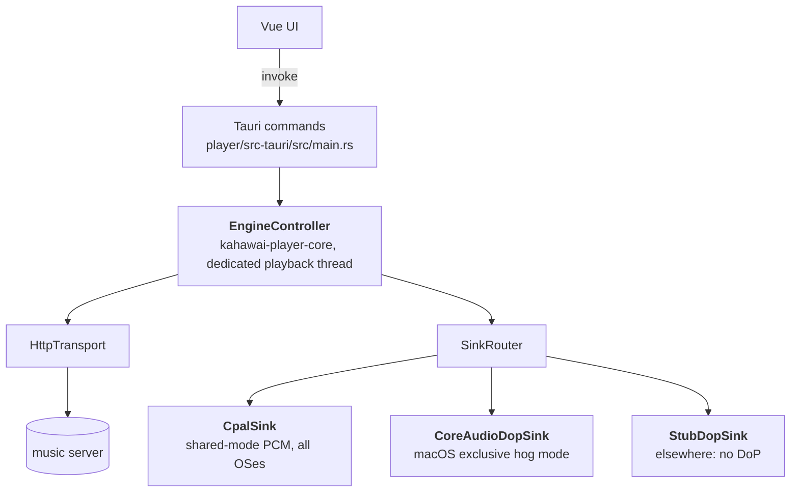

# Kahawai Player — desktop client (v1, C3)

Tauri 2 + Vue 3 + Pinia desktop client for the music streaming server.
macOS is the target platform; the Rust workspace builds and tests on Linux,
but the Tauri shell itself needs macOS (or GTK/WebKit dev packages) to link.

Phases: **C1** (shell + `kahawai-player-api` + `kahawai-player-core` engine + browse/queue/
now-playing UI) · **C2** (real audio output + v1 DSP) · **C3** (playlists,
jobs, settings, full now-playing view, universal-build script — this phase,
the final v1 client work).

## Layout

```
player/
  ui/            Vue 3 + Vite + Pinia + strict TypeScript frontend
  src-tauri/     Tauri 2 shell: commands, engine ownership, event bridge
scripts/
  build-client-universal.sh   macOS universal Tauri bundle (Mac-only)
```

`crates/kahawai-player-api` (async HTTP client), `crates/kahawai-player-core`
(platform-independent playback engine), and `crates/kahawai-player-audio` (real
OS audio sinks) live in the workspace root.

## Bit-perfect output and MQA

Settings → **Bit-perfect output** (Off / MQA files only / All tracks; macOS).
When it applies to a track, the engine sends the decoded samples to the
exclusive (hog-mode) device **untouched**: no EQ, analog warmth, loudness gain,
software volume or resampling, at the file's own sample rate, as packed 24-bit
(`bitperfect.rs`; the float→24-bit conversion is exact). That is what a DAC
that decodes MQA needs to see the MQA signal, and what "bit-perfect" means
generally.

- It only applies to a track streamed as-is (an explicit FLAC/Opus/MP3
  choice is a different signal). If the device can't take the file's exact
  sample rate, or the device is busy, that track plays through the normal
  shared path instead of failing.
- Tracks play one at a time (the server is not asked to chain the next
  track, since its rate may differ), so there is a brief gap between tracks.
- Volume is the DAC's: the volume slider dims and says so.
- The catalog marks MQA files (`MQAENCODER` tag; "MQA · 48k" badge). MQA
  itself is not decoded in software: it is proprietary. An MQA file plays as
  ordinary FLAC when bit-perfect is off.
- Underruns in this mode are true silence (a DoP-style silence pattern would
  be a burst of noise on a PCM stream).

## About dialog

**About Kahawai Player** (the `i` button in the sidebar, or the app menu's *About
Kahawai Player* on macOS) shows the bundled Markdown, the same way Koa's About
does:

- [`about.md`](ui/src/content/about.md) is written by hand: what the player is, what it
  does, how audio reaches your ears, privacy, copyright and trademarks, fonts, models
  and standards. `{{version}}` is replaced with the Tauri bundle version
  (`tauri.conf.json`, injected by `vite.config.ts`).
- [`notices.md`](ui/src/content/notices.md) is **generated**: run
  `python3 scripts/gen-notices.py` after changing dependencies. It reads the bundled
  fonts' own license files, the UI's direct npm dependencies and the direct Rust
  dependencies of the player (from `cargo metadata`), and calls out weak-copyleft
  components (currently Symphonia, MPL-2.0).
- Rendered by [`lib/about.ts`](ui/src/lib/about.ts) with `marked`. Links are shown as text
  with their address (the window has no permission to open external addresses), and raw
  HTML in the source is escaped.
- The native menu ([`menu.rs`](src-tauri/src/menu.rs)) owns no behaviour: the About item
  forwards its id in a `menu-action` event and the UI opens the dialog. The menu also
  restores the standard Edit and Window items a Mac app needs.

## UI stack and tests (`player/ui`)

Vue 3 + Pinia + strict TypeScript, styled with **Tailwind CSS v4** (design
tokens in `src/style.css` `@theme`) and built on **Reka UI** headless
primitives. `src/ui/` holds the shared primitives (`UiButton`, `UiSelect`,
`UiSlider`, `UiSwitch`, `UiDialog`, `PromptDialog`, `ConfirmDialog`, …);
components compose them and contain no hand-written CSS. Icons are
[Lucide](https://lucide.dev) SVGs (`lucide-vue-next`, tree-shaken); emoji and
text glyphs are not used as icons (a test enforces it). Native
`prompt()`/`confirm()` are not used (they do not work reliably in the Tauri
webview) — the dialog components replace them.

```bash
cd player/ui
npm test                # Vitest + Vue Test Utils + happy-dom (~370 tests)
npm run test:coverage   # v8 coverage summary
npm run build           # vue-tsc (typechecks the tests too) + vite build
```

Tests never touch the network or a real Tauri: `src/test/setup.ts` stubs
`fetch` (use `mockFetch` for routes) and provides a controllable Tauri
IPC/event mock (`tauri.on(cmd, result)`, `tauri.emit(event, payload)`,
`tauri.callsTo(cmd)`); `src/test/helpers.ts` has helpers for driving Reka
widgets (`openSelect`, `pick`, `openMenu`, …). Keyboard shortcuts live in
`src/shortcuts.ts` and yield to widgets that own keys (sliders, selects,
menus, dialogs, text fields).

## Architecture boundary



- The **frontend never touches the network for playback**. It invokes Tauri
  commands; the Rust core owns all playback state.
- Browsing (albums, artists, search, playlists) goes **directly** from the
  Vue app to the server's HTTP API — see `ui/src/api.ts`. Only playback
  crosses the Tauri bridge (`ui/src/tauri.ts` is the sole module that does).
- `kahawai-player-core` has **zero Tauri / platform imports** — the same crate will
  back the iOS/Android shells. All OS audio lives in `kahawai-player-audio`.
- State flows one way: the engine emits `player-state` events (~4 Hz while
  playing, immediately on track/state changes); the Pinia `player` store
  mirrors them and never invents state. On launch the UI also calls
  `get_state` directly, so a queue restored from disk hydrates even if the
  first event was emitted before the listener attached.

## Why these libraries

Same selection bias as the server (see root `README.md`): pure Rust where a
good crate exists, platform APIs only where no crate can reach, in-house
code only where no crate does the job.

| Crate / framework | Problem it solves | Why this one |
|---|---|---|
| `tauri` v2 | macOS desktop shell: web UI + Rust backend in one binary | Native window + IPC without shipping Electron/Chromium; and the v2 bet — Tauri 2 targets iOS/Android from the same codebase, so the client isn't a macOS dead end. |
| Vue 3 + Vite + Pinia + strict TypeScript (`player/ui`) | Reactive desktop UI with a hard bridge contract | Vue 3 composition API + Pinia stores (library / player / queue / playlists / jobs / settings) keep UI state boring; strict TS types mirror the Rust `PlayerState` so bridge mismatches fail at build time. |
| `cpal` | Cross-platform PCM audio output | One API for CoreAudio/WASAPI/ALSA — keeps the PCM path out of platform-specific code. Used for shared mode only; it can't do hog mode, which is why DoP goes around it. |
| `coreaudio-sys` (macOS only) | Hog-mode device access, exact nominal-rate switching, packed-24-bit format verification | cpal doesn't expose any of these. Raw FFI to the long-stable CoreAudio C API, `cfg`-gated so non-macOS builds never see it (a stub sink rejects DoP capability instead). |
| `ringbuf` | Lock-free SPSC ring between the decode thread and the real-time audio callback | The callback must never block or allocate; a bounded ring with silence-fill underruns is the standard shape, and `ringbuf` is exactly that. |
| `reqwest` (rustls-tls, no default features) | Async HTTP client for `kahawai-player-api` | Covers every server endpoint with the shared `kahawai-core` API types; `rustls` instead of native-tls so there are no system TLS dependencies. |
| `ureq` (in `kahawai-player-core`) | HTTP transport on the dedicated playback thread | On a thread that exists to block on I/O, a simple blocking client is less machinery than async — no runtime inside the engine. |
| `symphonia` (+ `symphonia-adapter-libopus`) | Decode server renditions (FLAC/Opus/MP3) to f32 PCM for the sink | Same rationale as the server: pure Rust, broad coverage, no system deps. |
| `serde` / `serde_json` / `thiserror` | Bridge payloads, persisted prefs, typed errors | Shared with the server crates; `engine-settings.json` and `queue.json` are plain JSON for debuggability. |

**Deliberately in-house:** the `AudioSink` trait seam (so iOS/Android are a
sink swap, not a rewrite), the playback state machine, the RBJ-biquad
parametric EQ (bypass asserted bit-transparent), and the R128-style loudness
measurement — each covered by tests against known-good values rather than
delegated to an audio framework.

## Audio paths

### PCM — shared mode

`CpalSink` opens the default device in **shared mode** at the track-native
rate when the device supports it; the engine resamples (cubic) only when
the device runs at a different rate. Chain order is fixed:

`decode → resample (if needed) → EQ → analog warmth (optional) → loudness → volume → sink`

The audio callback never blocks or allocates: it drains a lock-free ring
the engine feeds, fills underruns with silence, and counts them
(`underrun_count`).

### DoP — exclusive hog mode (macOS)

`CoreAudioDopSink` takes **hog mode** on the default output device, switches
its nominal sample rate to the exact DoP rate, forces a 24-bit packed
integer physical stream format, and **verifies both by readback** — any
failure releases the device and refuses. The engine's raw DoP frames are
written to the DAC untouched; underruns emit marker-correct DoP silence so
the DAC never loses frame sync.

The DoP path **bypasses everything**: no decode, no EQ, no loudness, no
volume, no resampling, no dither. The UI dims the volume slider and shows
an **Exclusive DoP** badge (`output_path: "dop-exclusive"` in
`player-state`) while it is active.

### DoP capability and fallback

Before opening a DoP stream the engine asks the sink whether the device
reports the required rate (176.4 / 352.8 / 705.6 kHz) in its available
nominal rates. If not, the track **falls back to the DSD→PCM/FLAC transcode**
and the reason is logged — playback continues, never errors. `dop_status`
exposes the current device's accepted rates to Settings.

## DSP (PCM only)

### Parametric EQ

- Up to 8 bands: peaking, low/high shelf, low/high pass; RBJ biquads.
- Settings → Parametric EQ: per-row enable, type, frequency (10–24000 Hz),
  gain (−24…+24 dB), Q (0.1–18). Changes apply live.
- The engine persists bands to `engine-settings.json`; the UI keeps the
  row model (including disabled rows) in localStorage and pushes the
  enabled subset to the core.

### Loudness normalization

- EBU R128-style K-weighting, integrated over 400 ms blocks; default
  target **−14 LUFS** (configurable −40…−1 in Settings).
- **First-play cost:** each track is pre-scanned before it plays — one
  extra deterministic stream, roughly **double the LAN bandwidth** for that
  first play. Measured gains are cached in memory by (track id, format),
  so repeats and seeks cost nothing extra. +12 dB boost cap, smooth gain
  ramps at track boundaries.

## Features (v1)

### Library & playback

- Albums, Artists, Search views; album detail with playable track list;
  artist detail; per-track format badges.
- Full **Now Playing** view: large artwork, metadata, format badge, a
  composed **audio-path** readout (e.g. `DSF DSD64 → DOP → Exclusive DoP ·
  bit-perfect`), seek bar with position/duration, transport, shuffle/repeat,
  volume, per-track format picker, track action menu, and EQ shortcut.
  Open it by clicking the now-playing bar identity.
- **Shuffle / repeat off/all/one** — transport controls in the bar, the
  queue view, and the full now-playing view; state lives in the Rust core
  and survives restarts with the queue.
- **Queue**: play-all-from, insert play-next, append, reorder
  (drag-and-drop), move up/down, remove, clear, save-as-playlist.
  Persisted to `queue.json` (tracks, cursor, repeat, shuffle, playhead) and restored
  on launch **without autoplay**.

### Track & album actions (⋯ menu)

Every track row, the now-playing bar, and album headers offer:

- **Play next** — insert right after the current queue item.
- **Add to queue** — append to the end, playback undisturbed.
- **Add to playlist…** — pick an existing playlist or create one inline.

Album headers additionally offer play-all / play-next / queue / playlist
for the whole album.

### Playlists

- List, create, rename (inline, optimistic with rollback on failure),
  delete (with confirm), open.
- Detail: play-from, play-all, add-all-to-queue, remove track, functional
  reorder (move up/down), rename, delete.
- **M3U/M3U8 import** (multipart upload): a result dialog reports the
  **matched count** and lists every **unmatched entry** verbatim.
- Save the current queue as a playlist.

### Jobs

- `POST /api/scan` from Settings → Library; a **409 means a scan is already
  running** — that's an info toast, not an error.
- The jobs store polls `GET /api/jobs` at ~2 Hz **only while jobs are
  active** (progress toasts update live; completion/failure close the
  progress toast and post a final toast). Launch picks up already-active
  jobs and polls them until they settle.

### Settings

- **Server URL** — persisted, live-rebuilds browse client + transport.
- **Default stream format** (global, server-side `set_format`).
- **DSD handling** — *Native DoP* (request DoP from the server; exclusive
  hog-mode path on macOS) or *Convert to PCM* (FLAC transcode; default).
  Explicit per-track/global format choices still win over this preference.
- **Audio output** — lists devices informationally only; v1 always plays
  PCM through the **system default device** (shared mode). Selecting a
  different device would require rebuilding the audio sink; documented as a
  limitation, not silently faked.
- Parametric EQ, loudness normalization, DoP capability readout.
- **Keyboard shortcuts** reference (see below).

## Keyboard map

Documented in-app under Settings → Keyboard shortcuts. Active everywhere
except while typing in a text field:

| Key | Action |
|-----|--------|
| `Space` | Play / pause |
| `←` / `→` | Seek ∓ 10 seconds |
| `↑` / `↓` | Volume up / down |
| `N` / `P` | Next / previous track |
| `F` | Go to search |
| `1` … `6` | Albums / Artists / Playlists / Search / Queue / Settings |

## Persistence

| What | Where |
|------|-------|
| Server URL, global format, DSD preference, DSP (EQ/loudness) | `<app-config-dir>/engine-settings.json` (Rust core) |
| Queue tracks, cursor, repeat, shuffle, playhead | `queue.json` next to it (Rust core) |
| EQ row model (incl. disabled rows), server URL for the browse client | browser `localStorage` |

Artwork comes through the browser's HTTP cache (ETag/304 from the server);
there is **no dedicated disk artwork cache in v1** — that's a v2 item.

## Running it

Start the server first (from the repo root):

```bash
cargo run -p kahawai-server
# binds 0.0.0.0:8080 by default
```

Run the UI in a browser-less dev shell:

```bash
cd player/ui
npm install
npm run dev        # Vite on http://localhost:1420
```

Run the full desktop app (needs macOS, or Linux with GTK/WebKit dev libs):

```bash
cd player/src-tauri
cargo tauri dev
```

The dev shell proxies the Vite dev server (`devUrl: http://localhost:1420`);
release builds bundle `player/ui/dist` (`npm run build` runs automatically
via `beforeBuildCommand`).

## Tauri command surface

`play_track {id}` · `queue_play {tracks, index}` · `queue_append {tracks}` ·
`queue_insert_next {tracks}` · `pause` · `resume` · `toggle` · `stop` ·
`seek_ms {ms}` · `next` / `prev` · `next_track` / `prev_track` ·
`set_repeat {mode}` · `set_shuffle {on}` · `set_format {fmt}` ·
`set_track_format {track_id, fmt}` · `set_volume {v}` · `get_state` ·
`get_server_url` · `set_server_url {url}` · `get_playback_prefs` ·
`set_dsd_story {story}` · `get_output_devices` · `set_eq_bands {bands}`
(validated, ≤ 8) · `set_eq_enabled {enabled}` ·
`set_loudness_target {lufs}` · `set_loudness_enabled {enabled}` ·
`get_dsp_settings` · `dop_status`

`queue_play` takes full `Track` objects (the UI owns the list);
`play_track` resolves one id through the browse API into a one-track queue.
`player-state` events carry the `PlayerState` shape in `ui/src/types.ts`
(`queue_index` is `null` when nothing has played yet; `repeat` and
`shuffle` ride the same payload).

## Packaging

```bash
scripts/build-client-universal.sh
```

- **Mac-only**: refuses to run anywhere else (needs `lipo` + Apple SDKs).
- Builds `player/ui` (`npm run build`), runs `cargo tauri build` for
  `x86_64-apple-darwin` and `aarch64-apple-darwin`, then `lipo`s the two
  app bundles into `dist/Kahawai Player.app`.
- **Untested here**: this workspace is Linux, so the universal flow has
  never been exercised — treat the first Mac run as validation, not routine.
- **Signing/notarization are manual** and deliberately not scripted: they
  need a paid Apple Developer identity. The script prints the recipe
  (`codesign --deep`, `notarytool submit`, `stapler`, `spctl` sanity check).

## v1 limitations (deliberate)

- **Trusted LAN, no auth/TLS** — same boundary as the server v1.
  Authentication/TLS is v2.
- Gapless only; **no crossfade**. Local playback only; **no remote control**.
- **Output-device selection**: informational device list; playback always
  uses the system default device.
- **Buffer status is honest**: the engine exposes no true network-buffer
  metric, so the UI shows the playhead position only (progressive HTTP
  stream) and says so where a buffer readout would be expected.
- **Artwork disk cache**: browser HTTP caching only; content-addressed
  LRU disk cache is v2.
- **SACD ISO is not supported and never will be** — see `docs/v1/SACD-Extraction.md`.
- **Offline mode**, **PCM exclusive-mode toggle**, **VST3/AU** are out of v1.

## Validation caveats

- The macOS CoreAudio code (`crates/kahawai-player-audio/src/coreaudio.rs`) is
  `cfg(target_os = "macos")` and **has never been compiled or run** — no
  Apple SDK, no CoreAudio headers, no libclang on this Linux VM. The FFI
  names are long-stable CoreAudio C API, but first real validation (hog
  acquisition, rate switching, 24-bit format verification, bit-perfect
  output on a DAC) happens on a Mac.
- `cargo check` on the shell fails in `gdk-sys` on this VM (no GTK/WebKit
  dev packages, no `sudo`). The shell was instead parsed by `rustfmt`
  (clean) — but not type-checked or linked. First native
  `cargo tauri build` happens on the Mac.

### Mac checklist (before calling v1 done)

1. First real `cargo tauri build` on a Mac.
2. CoreAudio compile + runtime: hog-mode acquisition, exact rate
   switching with readback, 24-bit packed format verification.
3. Bit-perfect DoP playback on a real DAC (marker-exact frames).
4. Universal bundle via `scripts/build-client-universal.sh`.
5. Signing + notarization with an Apple Developer identity.

## License

Kahawai is licensed under the GNU Affero General Public License v3.0 or later
(AGPL-3.0-or-later). See `LICENSE` for the full text.
